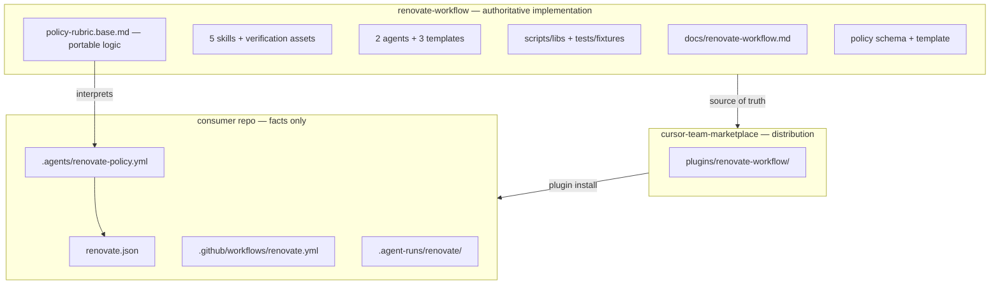

# Extract portable Renovate workflow

## Recommended execution authority

| Slice | Recommended authority | Agent instruction |
| --- | --- | --- |
| pr1-extract (+ pr1-policy-investigation, pr1-rubric-base) | Open PR only | Do not merge. Stop after opening the PR. |
| pr2-distribution | Open PR only | Do not merge. Stop after opening the PR. |
| pr3-codenames | Open PR only | Do not merge. Stop after opening the PR. |
| plan-closure | Open PR only | Do not merge. Stop after opening the PR. |

Repo default: **Open PR only**.

Per-slice rationale and verification details are in each slice section below.

## Repository topology (default)

The repository integration branch is `main`. Implementation slices start from and target `main`.

**Before implementation:** `git fetch` then a fresh branch from `origin/main`.

**Before opening the PR:** verify the branch represents only the current slice.

**After opening the PR:** verify the GitHub PR base branch is `main`.

PR3 targets `codenames-ai-guesser` (separate repo); PR1 and PR2 target `renovate-workflow`; PR2 may also span `cursor-team-marketplace`.

---

## Thesis

Create a **reusable Renovate workflow product**, not a template that sprays synchronized files into every repository.

- **renovate-workflow** owns portable decision logic and execution machinery (versioned once).
- **Consumer repos** provide repository-specific facts and configuration only.
- **Distribution** prefers the Cursor Team Marketplace plugin mechanism; copying into consumer repos is a **discovered constraint**, not the default architecture.
- **Future adapters** (non-Cursor agent ecosystems) can attach later without moving the core again.

## Architecture story

```text
PR1   Codenames capability  →  extraction  →  renovate-workflow (complete independent implementation)
PR2   renovate-workflow     →  adapter     →  Cursor Team Marketplace (+ minimum local runtime if required)
PR3   Codenames             →  consumer    →  deletes implementation; first real consumer
```

PR3 is the **portability acceptance test**: if Codenames can delete skills, agents, scripts, fixtures, and runbook while retaining only Renovate configuration + repository policy, the extraction worked.

## Ownership model



**Consumer repo should retain only:**

| File | Role |
| --- | --- |
| `renovate.json` | Renovate bot config (groups, schedule, branch prefix) |
| `.github/workflows/renovate.yml` | How Renovate runs in this repo |
| `.agents/renovate-policy.yml` | Repo-specific facts + check bindings |
| `.agent-runs/renovate/` (gitignored) | Local audit trail |

**Not a permanent consumer artifact (goal):** vendored copies of skills, agents, runbook, or script libs.

---

## Distribution (deliberately unresolved until PR2)

PR1 research suggests a hybrid is likely — not zero-copy everywhere — but **PR2's deliverable is to discover what actually has to be local**, not to decide the mechanism now.

**Working hypotheses** (input to PR2 investigation, not decisions):

| Asset | Likely plugin-only? | Notes |
| --- | --- | --- |
| Skills, runbook, methodology | Yes | team-harness precedent |
| Agent prompts + templates | Maybe | verify `@.agents/` resolution from plugin cache |
| Executable primitives (freshness poll, guardrails) | Maybe not | may need npm package or minimal local copy |
| `renovate-policy.yml`, `renovate.json`, workflows | No | inherently per-repo |

**PR2 discovers the minimum local boundary**, then implements only that. Plausible outcomes (not chosen in advance):

```text
Cursor plugin                    consumer repo
├── skills                       ├── renovate.json
├── agents                       ├── renovate-policy.yml
├── methodology                  └── @multipliers-dev/renovate-workflow  (executable primitives only)
└── templates
```

…or, if agent resolution requires local files, copy **those specific adapter artifacts** — still not a full-tree vendoring default.

**Explicitly deferred to PR2:** npm package vs minimal bootstrap vs local agent copies vs other adapter shape. Full `install-to-repo.sh` vendoring remains last resort only if lighter options fail verification.

**Invariant:** renovate-workflow repo stays canonical; cursor-team-marketplace is a distribution adapter, not a second source of truth.

**Do not build distribution tooling in PR1.**

---

## Policy sync investigation (avoid triple-sync)

Current codenames state maintains **three** representations with a documented sync obligation:

```
renovate.json  ↔  policy-rubric.md  ↔  renovate-policy.yml
```

During PR1, **investigate before institutionalizing any overlay file**.

### Target (default hypothesis for PR1)

```
renovate.json
     ↕ validation (optional script in PR2+)
renovate-policy.yml  ← single consumer config source
     ↓
policy-rubric.base.md  ← portable interpretation logic only
```

**Schema design principle:** store **facts necessary to derive classifications**, not derived classifications that can become contradictory.

**Extend `renovate-policy.yml` schema** to hold consumer facts currently only in rubric:

- `packages.high_touch`, `packages.low_risk_tooling` (explicit allowlists)
- `packages.runtime_rule` (e.g. "any `dependencies` entry under `repo.workspace_roots` not matched above")
- **`unlisted` is derived** — `package ∉ any configured classification` → `unlisted_package`
- `repo.workspace_roots`, `repo.sensitive_paths`, `checks.*`

**Portable `policy-rubric.base.md`** interprets consumer `.agents/renovate-policy.yml`; it is not another database of repository facts.

**Stop condition:** If package-list semantics cannot fit cleanly in YAML, document the exception — do **not** default to a third synchronized overlay file without justification.

---

## PR sequence

### PR1 — Portable core (renovate-workflow only)

**Recommended authority:** Open PR only

**Agent instruction:** Do not merge. Stop after opening the PR.

**Goal:** After merge, you can point at renovate-workflow and say **"this is the complete implementation."**

**Scope:**

1. Extract transitive runtime/contract dependencies from codenames-ai-guesser:
   - `docs/renovate-workflow.md`
   - `.cursor/skills/renovate-*` (15 files)
   - `.agents/renovate-*.md` + templates (6 files)
   - `scripts/lib/renovate-*`, `derive-stop-causes.ts`, CLIs, tests, fixtures (~18 files)

2. **Generalize** (remove codenames assumptions, preserve ladder semantics):
   - Resolve owner/repo from git remote; deployment-modes section (PAT + `renovate/` vs GitHub App)
   - CI references from consumer `renovate-policy.yml` checks
   - Remove archived-plan links from runbook

3. **Policy investigation + rubric split:**
   - `renovate-policy.template.yml` with extended consumer-facts sections
   - `policy-rubric.base.md` (portable logic interpreting policy YAML)
   - **Synthetic example only:** `examples/example-repo/renovate-policy.yml`
   - Codenames parity validation in **PR3**, not upstream

4. **Wire package:** `yaml` dep, `scripts/tsconfig.json`, vitest, update `AGENTS.md` and `README.md`

5. **Out of scope:** install scripts, marketplace plugin, codenames migration, semantic redesign

**Acceptance:**

- `npm test` and `npm run typecheck` green in renovate-workflow
- All moved fixtures pass
- Skill cross-links resolve within renovate-workflow tree
- `docs/policy-setup.md` documents chosen sync model

---

### PR2 — Distribution / adapter (discover, then implement minimum)

**Recommended authority:** Open PR only

**Prerequisite:** PR1 merged; renovate-workflow tagged.

**Goal:** Discover **what must be local**, then implement the **smallest adapter**.

**Phase A — discovery:**

- Plugin-cache resolution for skills, agents, templates, runbook
- Consumer-workspace access to `.agents/renovate-policy.yml`
- Freshness-poll and guardrail invocation paths
- Document minimum local boundary with evidence

**Phase B — implement:**

- Marketplace plugin synced from renovate-workflow release
- Plus only whatever local runtime discovery requires
- `docs/adopt.md`

**Acceptance:** Another repo can adopt without vendoring 40 files or depending on codenames.

---

### PR3 — Codenames migration (first consumer + acceptance test)

**Recommended authority:** Open PR only

**Prerequisites:** PR1 + PR2 merged; adapter published.

**Goal:** Codenames **consumes** the product; **deletes authoritative implementation**.

**Consumer retains:** `renovate.json`, `.github/workflows/renovate.yml`, `.agents/renovate-policy.yml`, `.gitignore` for `.agent-runs/renovate/`

**Delete from codenames:** skills, agent prompts, templates, renovate scripts/libs/tests/fixtures, `docs/renovate-workflow.md`

**Acceptance (portability test):**

- Workflow operable via plugin + PR2 adapter after deleting implementation artifacts
- Extended `renovate-policy.yml` preserves classification parity (validated here)
- Skill verification checklists pass; `/renovate-classifier` dry-run on real PR

---

## Target layout in renovate-workflow (PR1)

```
renovate-workflow/
├── docs/
│   ├── renovate-workflow.md
│   └── policy-setup.md
├── .cursor/skills/renovate-{role}/
├── .agents/
│   ├── renovate-maintainer.md
│   ├── renovate-investigator.md
│   ├── renovate-policy.template.yml
│   └── templates/
├── scripts/
│   ├── lib/
│   ├── fixtures/
│   └── renovate-freshness-poll.ts
├── examples/
│   └── example-repo/
│       └── renovate-policy.yml
├── AGENTS.md
├── README.md
└── package.json
```

---

## Behavioral preservation invariant

Generalization removes **repository-specific assumptions**, not ladder semantics. Redesign only where portability mechanically requires it.

---

## Plan closure (docs-only PR)

After PR3 merges: verify slice todos, add `# Shipped` note, move plan to `.cursor/plans/archive/2026-08-31-extract-renovate-workflow.plan.md`, mark `plan-closure` completed.

---

## Agent prompts (copy/paste for Cursor)

Use a **fresh Agent-mode chat** per slice.

### pr1-extract

```text
@.cursor/plans/2026-08-31-extract-renovate-workflow.plan.md

Implement PR1 (portable core) only — covers pr1-extract, pr1-policy-investigation, and pr1-rubric-base. Do not start pr2-distribution, pr3-codenames, or plan-closure. Do not archive the plan.

Authority: Open PR only — implement and open the PR; do not merge.

Topology: start from latest origin/main in renovate-workflow; branch represents only this slice; PR base must be main.

Deliverables: extract dependency closure from codenames-ai-guesser; generalize codenames assumptions; consolidate consumer facts into renovate-policy.yml schema (derive unlisted from absence); split policy-rubric.base.md; synthetic examples/example-repo/renovate-policy.yml only; wire tests. Mark pr1-extract, pr1-policy-investigation, and pr1-rubric-base completed in plan frontmatter in this PR.

Verification: npm test and npm run typecheck green; fixtures pass; docs/policy-setup.md documents sync model; no distribution tooling or codenames migration.
```

### pr2-distribution

```text
@.cursor/plans/2026-08-31-extract-renovate-workflow.plan.md

Implement slice pr2-distribution only. Prerequisite: PR1 merged and renovate-workflow tagged. Do not start pr3-codenames or plan-closure. Do not archive the plan.

Authority: Open PR only — implement and open the PR; do not merge.

Topology: start from latest origin/main; branch represents only this slice; PR base must be main. May span renovate-workflow and cursor-team-marketplace as separate PRs if needed.

Deliverables: discover minimum local boundary (Phase A evidence); implement smallest adapter (Phase B). Mark pr2-distribution completed in plan frontmatter in this PR.

Verification: adoption path documented in docs/adopt.md; no full-tree vendoring unless lighter options failed verification.
```

### pr3-codenames

```text
@.cursor/plans/2026-08-31-extract-renovate-workflow.plan.md

Implement slice pr3-codenames only in codenames-ai-guesser. Prerequisites: PR1 + PR2 merged; adapter published. Do not start plan-closure. Do not archive the plan.

Authority: Open PR only — implement and open the PR; do not merge.

Topology: start from latest origin/main in codenames-ai-guesser; branch represents only this slice; PR base must be main.

Deliverables: adopt plugin + PR2 adapter; delete authoritative renovate implementation duplicates; retain renovate.json, workflows, renovate-policy.yml only; update AGENTS.md/README links. Mark pr3-codenames completed in plan frontmatter in this PR.

Verification: portability acceptance test passes — workflow operable after deletion; classification parity; skill verification checklists; renovate-classifier dry-run on real PR.
```

### plan-closure

```text
@.cursor/plans/2026-08-31-extract-renovate-workflow.plan.md

Execute only plan-closure in renovate-workflow.

Authority: Open PR only — docs-only archive PR; do not merge.

Prerequisites: pr1-extract, pr1-policy-investigation, pr1-rubric-base, pr2-distribution, and pr3-codenames merged and marked completed in frontmatter.

Topology: start from latest origin/main; branch represents only this slice; PR base must be main.

Deliverables: verify slice todos, add # Shipped note, move plan to .cursor/plans/archive/2026-08-31-extract-renovate-workflow.plan.md, mark plan-closure completed, update agent prompt references to the archived path.

Verification: all prerequisite implementation PRs merged before archiving.
```
