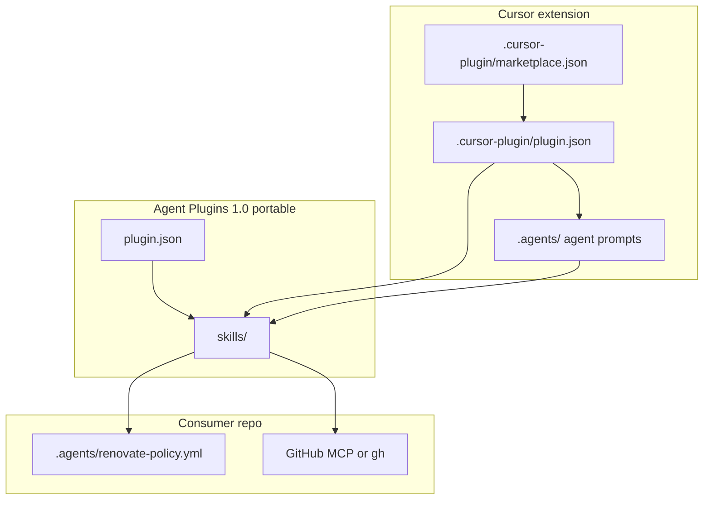

# Agent Plugins 1.0 migration for renovate-workflow

## Recommended execution authority

| Slice | Recommended authority | Agent instruction |
| --- | --- | --- |
| agent-plugins-migration | Open PR only | Do not merge. Stop after opening the PR. |
| plan-closure | Open PR only | Do not merge. Stop after opening the PR. |

Repo default: **Open PR only**.

Per-slice rationale and verification details are in each slice section below.

## Repository topology (default)

The repository integration branch is `main`. Implementation slices start from and target `main`.

**Before implementation:** `git fetch` then a fresh branch from `origin/main`.

**Before opening the PR:** verify the branch represents only the current slice.

**After opening the PR:** verify the GitHub PR base branch is `main`.

---

## Current state (inventory)

### Portable under Agent Plugins 1.0

| Asset | Current path | Notes |
| --- | --- | --- |
| Five Renovate skills | `.cursor/skills/renovate-*` | Valid Agent Skills (`SKILL.md` + frontmatter); wrong discovery location |
| Portable rubric | `.agents/policy-rubric.base.md` | Not a v1 component type; ships in plugin clone, linked from skills |
| Policy template + report templates | `.agents/renovate-policy.template.yml`, `.agents/templates/` | Same — repo files consumed by skills/agents |
| Runbook + adoption docs | `docs/` | Shipped with repo; not a plugin component |
| npm scripts / guardrails | `scripts/` | Separate distribution layer (git devDependency); unchanged |

**No `mcp.json`** — correct to omit. Skills expect consumer-side GitHub MCP or `gh`.

### Cursor-specific (keep out of portable core)

| Asset | Path | Role |
| --- | --- | --- |
| Cursor plugin manifest | `.cursor-plugin/plugin.json` | Declares `agents`; will point skills at `./skills` |
| Marketplace catalog | `.cursor-plugin/marketplace.json` | GitHub import → install flow (`"source": "."`) |
| Agent executor prompts | `.agents/renovate-maintainer.md`, `.agents/renovate-investigator.md` | Cursor `agents` component (not in Agent Plugins v1) |
| Repo dev hooks / Cloud VM | `.cursor/hooks.json`, `.cursor/environment.json` | This repo's Layer 1 hook stack — **not** consumer plugin surface |
| Skill frontmatter `disable-model-invocation` | all five skills | Cursor ergonomics; harmless for other clients |

### Conflicts with Agent Plugins 1.0 today

1. **No root `plugin.json`** — spec requires manifest at plugin root.
2. **Skills under `.cursor/skills/`** — v1 fixed location is `skills/` only; manifest cannot override.
3. **Current `.cursor-plugin/plugin.json` puts `skills` / `agents` at top level** — valid for Cursor, but those fields are **invalid** on the portable root manifest (closed schema: metadata + `extensions` only).
4. **Missing `$schema`** on any manifest.
5. **No plugin-structure validation in CI** — only ladder/guardrail tests referencing `.cursor/skills/renovate-classifier/packet-schema.md`.

Cursor explicitly supports **both** formats side by side: root `plugin.json` (portable skills + MCP) + `.cursor-plugin/plugin.json` (agents, hooks, rules, etc.).

---

## Proposed file layout (after migration)

```text
renovate-workflow/
├── plugin.json                    # NEW — Agent Plugins 1.0 portable manifest
├── skills/                        # MOVED from .cursor/skills/
│   ├── renovate-classifier/
│   ├── renovate-loop/
│   ├── renovate-investigator/
│   ├── renovate-maintainer/
│   └── renovate-draft-readiness/
├── .cursor-plugin/
│   ├── marketplace.json           # unchanged role
│   └── plugin.json                # UPDATE — Cursor overlay (agents + explicit skills path)
├── .agents/                       # unchanged location (Cursor agents + portable assets)
├── .cursor/                       # repo-local Cursor dev only (NOT plugin-distributed)
├── scripts/                       # unchanged
└── docs/                          # UPDATE — portable vs Cursor section
```

No `mcp.json`. No duplicate skill tree. Remove empty `.cursor/skills/` after move.

---

## Slice — agent-plugins-migration

**Recommended authority:** Open PR only

**Rationale:**

- Smallest sensible migration to [Agent Plugins 1.0](https://agent-plugins.org/specification) without a big-bang rewrite.
- Establishes the reference pattern for later `editorial-workflow` migration.
- **0.2.0** signals externally visible path changes (`.cursor/skills/` → `skills/`) even though ladder behavior is unchanged.

**Agent instruction:** Do not merge. Stop after opening the PR.

**Goal:** Portable core conforms to Agent Plugins 1.0; Cursor-specific behavior preserved.

**Deliverables:**

1. Add root `plugin.json` with `$schema`, metadata, version **0.2.0** (no `skills` / `agents` keys).
2. `git mv .cursor/skills/* skills/`; fix in-skill relative links (e.g. `../../../.agents` → `../../.agents`).
3. Update `.cursor-plugin/plugin.json`: `"skills": "./skills"`, `"agents": "./.agents"`, version **0.2.0**.
4. Bulk-update `.cursor/skills/` → `skills/` in agents, docs, tests, policy `sensitive_paths`, verification blocks.
5. Add `scripts/validate-plugin-structure.test.ts` (wired into `npm test`). Assert the closed portable schema: root `plugin.json` permits only Agent Plugins top-level fields (`$schema`, `name`, `version`, `description`, `author`, `homepage`, `repository`, `license`, `keywords`, `extensions`). **Do not relax this test** if implementation tempts convenience fields (`skills`, `agents`, etc.) — put those in `.cursor-plugin/plugin.json` only.
6. Bump `package.json` to **0.2.0**; update `docs/versioning.md`, `docs/adopt.md`, `README.md` with portable vs Cursor layer table and upgrade note.
7. Mark `agent-plugins-migration` completed in plan frontmatter in the implementation PR.

**Acceptance:**

- `npm test` and `npm run typecheck` pass.
- No remaining `.cursor/skills` references outside archived plans.
- Root `plugin.json` conforms to closed Agent Plugins schema (no component path fields or other non-portable top-level keys). If Cursor suggests extra convenience fields during implementation, **reject them** — fix the manifest, not the test.
- Version **0.2.0** aligned across `package.json`, root `plugin.json`, `.cursor-plugin/plugin.json`.
- Post-merge: marketplace import still lists plugin; `/renovate-classifier` resolves from installed plugin.

**Out of scope:** `mcp.json`, shipping `.cursor/hooks` to consumers, ladder semantics changes, public Cursor Marketplace submission.

---

## Slice — plan-closure

**Recommended authority:** Open PR only

**Rationale:** Docs-only archival after the implementation PR merges.

**Agent instruction:** Do not merge. Stop after opening the PR.

After `agent-plugins-migration` merges:

1. Verify the implementation PR is merged to `main`.
2. Verify slice todos are `completed` or `cancelled`.
3. Add `# Shipped` with date, PR links, deferred work.
4. Move to `.cursor/plans/archive/2026-09-14-agent-plugins-1.0-migration.plan.md`.
5. Mark `plan-closure` completed; update references.

---

## Architecture after migration



---

## Compatibility risks

| Risk | Mitigation |
| --- | --- |
| Installed plugin cache still points at old `.cursor/skills/` | Document reinstall / reload after upgrade in adopt guide; slash commands unchanged |
| Deep links to `.cursor/skills/...` | One-time path rename; grep ensures repo-internal refs updated |
| Consumers on 0.1.0 path assumptions | **0.2.0** version signal + adopt-guide upgrade note |

**Version:** ship **0.2.0** (required). Path rename is externally visible even though runtime behavior is unchanged.

---

## Template conventions for editorial-workflow (later)

1. Dual manifest — root `plugin.json` + `.cursor-plugin/plugin.json`.
2. Skills at `skills/` — never under `.cursor/skills/`.
3. `.cursor-plugin/marketplace.json` — single-plugin `"source": "."` marketplace.
4. Keep Cursor-only paths explicit — `.cursor/hooks.json`, `.cursor/environment.json` stay repo-dev.
5. Hub facts stay consumer-local — `.agents/*.yml` pattern.
6. npm `files` / git dep boundary — scripts in npm package; skills via plugin only.
7. `scripts/validate-plugin-structure.test.ts` — copy/adapt Vitest guard.
8. Docs table — portable / Cursor / npm / consumer-local layers.

---

## Agent prompts (copy/paste for Cursor)

Use a **fresh Agent-mode chat** per slice.

### agent-plugins-migration

```text
@.cursor/plans/2026-09-14-agent-plugins-1.0-migration.plan.md

Implement slice agent-plugins-migration only. Do not start plan-closure. Do not archive the plan.

Authority: Open PR only — implement and open the PR; do not merge.

Topology: start from latest origin/main; branch represents only this slice; PR base must be main.

Deliverables: per the plan slice — root Agent Plugins 1.0 plugin.json; move skills to skills/; update .cursor-plugin/plugin.json; bulk-update cross-references; add validate-plugin-structure.test.ts; bump to 0.2.0 across package.json and both manifests; document portable vs Cursor layers in adopt.md/README and versioning.md. Mark agent-plugins-migration completed in plan frontmatter in this PR.

Verification: npm test; npm run typecheck; grep for stale .cursor/skills references outside archived plans. Root plugin.json must pass the closed-schema test as written — do not add convenience fields to the portable manifest or weaken validation to accept them.
```

### plan-closure

```text
@.cursor/plans/archive/2026-09-14-agent-plugins-1.0-migration.plan.md

Execute only plan-closure.

Authority: Open PR only — docs-only archive PR; do not merge.

Prerequisites: agent-plugins-migration PR actually merged to main.

Topology: start from latest origin/main; branch represents only this slice; PR base must be main.

Deliverables: verify slice todos, add # Shipped note, move plan to .cursor/plans/archive/2026-09-14-agent-plugins-1.0-migration.plan.md, mark plan-closure completed, update agent prompt references to the archived path.

Verification: confirm the implementation PR is merged and agent-plugins-migration todo is completed before archiving.
```
