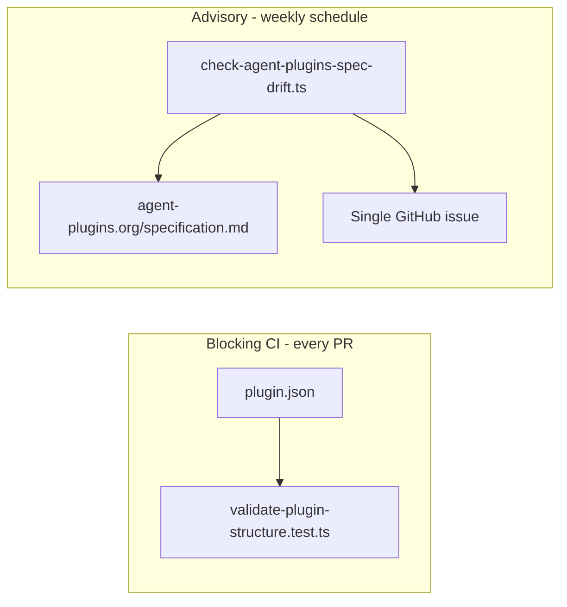

# Agent Plugins spec-drift detection

## Recommended execution authority

| Slice | Recommended authority | Agent instruction |
| --- | --- | --- |
| plan-review | Plan-only PR | Do not implement. Stop after opening the plan-only PR. |
| spec-drift-detection | Open PR only | Do not merge. Stop after opening the PR. |
| plan-closure | Open PR only | Do not merge. Stop after opening the PR. |

Repo default: **Open PR only**.

Per-slice rationale and verification details are in each slice section below.

## Repository topology (default)

The repository integration branch is `main`. Implementation slices start from and target `main`.

**Before implementation:** `git fetch` then a fresh branch from `origin/main`.

**Before opening the PR:** verify the branch represents only the current slice.

**After opening the PR:** verify the GitHub PR base branch is `main`.

---

## Context (verified)

**Current conformance (blocking, offline):** [`scripts/validate-plugin-structure.test.ts`](scripts/validate-plugin-structure.test.ts) runs via `npm test` in [`.github/workflows/ci.yml`](.github/workflows/ci.yml). It enforces:

- Closed portable top-level keys (Agent Plugins §5.2)
- Hardcoded `$schema`: `https://agent-plugins.org/schemas/1.0.0/plugin.schema.json`
- No `skills`/`agents` on root [`plugin.json`](plugin.json)
- Fixed `skills/<name>/SKILL.md` layout
- Cursor overlay boundary in [`.cursor-plugin/plugin.json`](.cursor-plugin/plugin.json)

**Upstream spec model (verified):**

| Signal | Source | Notes |
| --- | --- | --- |
| Published spec version | [`https://agent-plugins.org/specification.md`](https://agent-plugins.org/specification.md) | Header: `Spec Version: X.Y.Z` + `Status: Published` |
| Schema URL pattern | `https://agent-plugins.org/schemas/{semver}/plugin.schema.json` | Immutable per release |
| Draft vs published | `1.1.0` exists in GitHub repo but **404** on agent-plugins.org | Must **not** treat repo `schemas/` max semver as published |

There is **no** official `/latest` endpoint, version index API, npm package, or GitHub releases/tags. Discovery must use **both** published signals (see below); neither alone is sufficient.



## Policy (non-negotiable)

| Concern | Behavior |
| --- | --- |
| Declared-spec conformance | **Blocking** — existing `npm test`; no network |
| Repo `behind` latest published spec | **Advisory** — scheduled workflow opens/updates issue; exit 0 |
| Repo `current` with published spec | **Advisory** — close any open drift issue; exit 0 |
| Repo `ahead` of discovered published spec | **Advisory warning** — do not mutate/close issue; exit 0 |
| Spec migration | **Manual reviewed work** — never auto-edit `plugin.json` or bump `$schema` |
| PR / push CI | Must **not** fail solely because a newer spec exists |

## Architecture

### 1. Shared pure library — `scripts/lib/agent-plugins-spec.ts`

Repo-local, portable to `cursor-team-marketplace` later (copy or adapt; no shared package).

**Exports (all deterministic / offline-testable):**

- `AGENT_PLUGINS_SCHEMA_BASE`, `PUBLISHED_SPEC_MD_URL` constants
- `parseDeclaredSpecVersion($schema: string): string` — extract semver from `$schema` URL; throw on malformed
- `parsePublishedSpecVersion(specMarkdown: string): string` — regex `Spec Version: X.Y.Z` when `Status: Published` is present; throw if missing/ambiguous
- `compareSemver(a, b): -1 | 0 | 1` — major.minor.patch only (no prerelease needed today)
- `SpecVersionRelationship = "behind" | "current" | "ahead"` — explicit comparison of declared vs latest **published** upstream version
- `evaluateSpecRelationship({ declared, published }): { relationship, driftDetected, declaredVersion, latestPublishedVersion, ... }` where `driftDetected` is a derived convenience: `relationship === "behind"`

**Published-version gate (mandatory, enforced in CLI):** treat a version as published upstream only when **both** are true:

1. [`specification.md`](https://agent-plugins.org/specification.md) reports that version with `Status: Published`
2. `https://agent-plugins.org/schemas/{version}/plugin.schema.json` returns HTTP **200**

If those signals disagree (e.g. markdown says `1.1.0` Published but schema URL 404), the check **fails** as an upstream/check error — do **not** report `behind`/`current`/`ahead` drift.

**Network isolation:** fetch logic lives only in the CLI wrapper, not in the library or `npm test`.

### 2. CLI — `scripts/check-agent-plugins-spec-drift.ts`

Follow [`scripts/renovate-freshness-poll.ts`](scripts/renovate-freshness-poll.ts) conventions (`tsx`, `--help`, JSON stdout).

**Behavior:**

1. Read root `plugin.json` (configurable `--plugin-json` for reuse)
2. Parse declared version from `$schema`
3. `fetch(PUBLISHED_SPEC_MD_URL)` — official source only; non-2xx → **exit 1**
4. Parse candidate published version from markdown (`Status: Published` required)
5. **Mandatory** schema confirmation: `HEAD` or `GET` `https://agent-plugins.org/schemas/{version}/plugin.schema.json` — non-200 → **exit 1** (upstream/check error, not drift)
6. If markdown version and schema-URL availability disagree, **exit 1** with explicit upstream-signal-mismatch error
7. Compare declared vs confirmed published version → `relationship`
8. Emit machine-readable JSON (`--json` flag or default stdout):

```json
{
  "declaredVersion": "1.0.0",
  "latestPublishedVersion": "1.0.0",
  "relationship": "current",
  "driftDetected": false,
  "advisory": true,
  "declaredSchemaUrl": "https://agent-plugins.org/schemas/1.0.0/plugin.schema.json",
  "publishedSpecUrl": "https://agent-plugins.org/specification",
  "publishedSchemaUrl": "https://agent-plugins.org/schemas/1.0.0/plugin.schema.json"
}
```

`relationship` semantics:

| Value | Meaning | `driftDetected` |
| --- | --- | --- |
| `behind` | declared &lt; latest confirmed published | `true` |
| `current` | declared === latest confirmed published | `false` |
| `ahead` | declared &gt; latest confirmed published | `false` |

**Exit codes:**

- `0` — check succeeded (all relationships including `behind` and `ahead`)
- `1` — malformed local config, upstream fetch/parse failure, schema non-200, or published-signal mismatch

Add npm script: `"check:agent-plugins-spec-drift": "tsx scripts/check-agent-plugins-spec-drift.ts"`

**Do not** add this script to `npm test` or [`.husky/pre-commit`](.husky/pre-commit).

### 3. Deterministic tests — `scripts/agent-plugins-spec-drift.test.ts`

Vitest; mock `fetch` only in CLI integration tests if needed; library tests use fixture strings.

| Case | Expected |
| --- | --- |
| Same version | `relationship: "current"`, `driftDetected: false` |
| Newer upstream minor | `relationship: "behind"`, `driftDetected: true` |
| Newer upstream major | `relationship: "behind"`, `driftDetected: true` |
| Local newer than discovered upstream | `relationship: "ahead"`, `driftDetected: false` |
| Malformed `$schema` / missing version | throws / CLI exit 1 |
| Upstream markdown missing `Spec Version` or not `Published` | throws / CLI exit 1 |
| Markdown says Published but schema URL non-200 | CLI exit 1 (upstream/check error) |
| Schema URL 200 but markdown version disagrees | CLI exit 1 (signal mismatch) |
| Upstream fetch failure | CLI exit 1 |

Existing [`validate-plugin-structure.test.ts`](scripts/validate-plugin-structure.test.ts) stays unchanged in intent. Optional: import shared schema URL constant to avoid drift between files — **do not** remove or relax any assertion.

### 4. Advisory notification — `.github/workflows/agent-plugins-spec-drift.yml`

**Chosen mechanism:** weekly scheduled GitHub Action maintaining **one deduplicated issue** (preferred over Renovate/Dependabot — spec is not a package dependency; over workflow-summary-only — issue is persistent and actionable).

```yaml
on:
  schedule:
    - cron: "0 9 * * 1"   # Monday 09:00 UTC — low noise
  workflow_dispatch:

permissions:
  contents: read
  issues: write
```

**Steps:**

1. `actions/checkout` + `actions/setup-node` (pin SHAs like [`ci.yml`](.github/workflows/ci.yml))
2. `npm ci`
3. Run `npm run check:agent-plugins-spec-drift -- --json` → capture output
4. Issue management via **`gh` CLI** (repo already documents `gh` as preferred GitHub interface):

| `relationship` | Action |
| --- | --- |
| `behind` | Find open issue with label `agent-plugins-spec-drift`. If none, **create and assign to the repository maintainer** (see below). If one exists for same `latestPublishedVersion`, refresh body only (preserve assignee). If exists for older version, update title/body to supersede (preserve assignee). |
| `current` | Close any open `agent-plugins-spec-drift` issues with a short comment ("repo now targets latest published spec") |
| `ahead` | **Do not** create, update, or close the advisory issue. Emit an **advisory workflow warning** (e.g. `::warning::` or job summary) explaining declared version exceeds discovered published version — upstream discovery may have regressed or the repo may intentionally target a not-yet-observed version |

**Assignee on create:** newly created drift issues must be assigned to the **repository maintainer** so they surface in GitHub notifications and the assignee's issue queue (more reliable than an unassigned label-only issue). Example:

```text
Agent Plugins 1.1.0 available — review migration
Assignee: <maintainer>
```

**Implementation:** resolve assignee via a workflow env constant (e.g. `AGENT_PLUGINS_DRIFT_ASSIGNEE`) set to the maintainer's GitHub username for this repo (`gh issue create --assignee "$AGENT_PLUGINS_DRIFT_ASSIGNEE"`). Use org-owner lookup only when the owner is a user account; for org-owned repos, pin the human maintainer handle explicitly. **Assign on create only** — body refresh and supersede steps must not clear an existing assignee. Portable to `cursor-team-marketplace` by changing the constant per repo.

**Issue template:**

- **Title:** `Agent Plugins {latestPublishedVersion} available — review migration`
- **Label:** `agent-plugins-spec-drift` (create label in workflow if missing, or document one-time manual label creation)
- **Assignee:** repository maintainer (on create)
- **Body must include:**
  - Current declared version (from `plugin.json`)
  - Latest published upstream version
  - Links: [specification](https://agent-plugins.org/specification), published schema URL
  - Explicit advisory disclaimer: plugin remains valid against declared spec; conformance CI is unchanged; migration is manual
  - No auto-PR language

**Not in scope for this workflow:** PR creation, `plugin.json` edits, running on `pull_request`.

### 5. Documentation — update [`docs/versioning.md`](docs/versioning.md)

Add a **Agent Plugins spec version** section (distinct from package `0.2.0`):

- Repo targets **Agent Plugins spec 1.0.0** via `$schema`
- **Conformance** = offline `npm test` / `validate-plugin-structure`
- **Drift** = weekly advisory check + optional manual `npm run check:agent-plugins-spec-drift`; outputs `relationship` (`behind` / `current` / `ahead`)
- Published upstream version requires **both** `specification.md` `Status: Published` **and** schema URL HTTP 200; signal mismatch fails the check
- `ahead` emits a workflow warning only — does not close an existing advisory issue
- New drift issues are assigned to the repository maintainer on create (actionable notification)
- Upgrades require explicit reviewed migration (reference archived [Agent Plugins 1.0 migration plan](.cursor/plans/archive/2026-09-14-agent-plugins-1.0-migration.plan.md))
- Note: drafts in upstream GitHub (e.g. 1.1.0) are ignored until both published signals confirm on agent-plugins.org

No new standalone doc file unless a short cross-link in [`README.md`](README.md) layout section helps discoverability.

## Portability notes (cursor-team-marketplace)

Same pattern later:

- Copy/adapt `scripts/lib/agent-plugins-spec.ts` + CLI + tests
- Point `--plugin-json` at `plugins/team-harness/plugin.json`
- Add equivalent scheduled workflow in that repo
- Keep marketplace `scripts/check.sh` boundary validation as its blocking layer

## Out of scope

- Migrating beyond Agent Plugins 1.0.0
- Network schema fetching in conformance tests
- Auto-bump `$schema` or migration PRs
- Failing PR CI on upstream drift
- Relaxing closed-schema validation

---

## Slice — spec-drift-detection

**Authority:** Open PR only — implement and open PR; do not merge.

**Branch:** fresh from `origin/main`; PR targets `main`; diff contains only this slice.

**Deliverables:**

- [`scripts/lib/agent-plugins-spec.ts`](scripts/lib/agent-plugins-spec.ts)
- [`scripts/check-agent-plugins-spec-drift.ts`](scripts/check-agent-plugins-spec-drift.ts)
- [`scripts/agent-plugins-spec-drift.test.ts`](scripts/agent-plugins-spec-drift.test.ts)
- [`.github/workflows/agent-plugins-spec-drift.yml`](.github/workflows/agent-plugins-spec-drift.yml)
- [`package.json`](package.json) script entry
- [`docs/versioning.md`](docs/versioning.md) updates

**Acceptance:**

- `npm test` and `npm run typecheck` pass (existing conformance unchanged)
- `npm run check:agent-plugins-spec-drift` succeeds locally with `relationship: "current"` against published 1.0.0 (both signals agree today)
- CLI exits 0 for `behind`, `current`, and `ahead`; exits 1 only for local config errors or upstream/check failures (including published-signal mismatch)
- Mandatory schema URL 200 check is implemented; markdown-only or schema-only signals never produce drift
- Scheduled workflow: `behind` → issue create/update (assign maintainer on create); `current` → close issue; `ahead` → workflow warning only (no issue mutation)
- Scheduled workflow has minimal permissions and pinned actions
- Issue deduplication logic documented in workflow comments

**Verification:**

```bash
npm test
npm run typecheck
npm run check:agent-plugins-spec-drift -- --json
```

Mark `spec-drift-detection` completed in plan frontmatter in the implementation PR.

---

## Slice — plan-closure

**Authority:** Open PR only — docs-only archive PR; do not merge.

**Prerequisite:** `spec-drift-detection` merged.

**Deliverables:**

1. Verify `spec-drift-detection` todo is `completed`
2. Add `# Shipped` closure note to plan body
3. Move plan to [`.cursor/plans/archive/2026-09-14-agent-plugins-spec-drift.plan.md`](.cursor/plans/archive/2026-09-14-agent-plugins-spec-drift.plan.md)
4. Mark `plan-closure` completed; update agent prompt paths to archived location

---

## Agent prompts (copy/paste for Cursor)

### spec-drift-detection

```text
@.cursor/plans/2026-09-14-agent-plugins-spec-drift.plan.md

Implement slice spec-drift-detection only. Do not start plan-closure. Do not archive the plan.

Authority: Open PR only — implement and open the PR; do not merge.

Topology: start from latest origin/main; branch represents only this slice; PR base must be main.

Deliverables:
- scripts/lib/agent-plugins-spec.ts (pure parse/compare helpers; relationship: behind|current|ahead; driftDetected derived)
- scripts/check-agent-plugins-spec-drift.ts (network CLI; mandatory dual-signal published confirmation; exit 0 for behind/current/ahead)
- scripts/agent-plugins-spec-drift.test.ts (offline tests per plan, including signal-mismatch failure cases)
- .github/workflows/agent-plugins-spec-drift.yml (weekly schedule + workflow_dispatch; behind→create/update issue with maintainer assignee on create, current→close, ahead→warning only)
- package.json script check:agent-plugins-spec-drift
- docs/versioning.md (conformance vs drift; relationship semantics; manual run; no auto-migration)

Do not:
- migrate beyond Agent Plugins 1.0.0
- weaken validate-plugin-structure.test.ts
- add network checks to npm test or pre-commit
- fail PR CI on upstream drift
- auto-edit plugin.json or open migration PRs

Mark spec-drift-detection completed in plan frontmatter in this PR.

Verification: npm test; npm run typecheck; npm run check:agent-plugins-spec-drift -- --json
```

### plan-closure

```text
@.cursor/plans/2026-09-14-agent-plugins-spec-drift.plan.md

Execute only plan-closure.

Authority: Open PR only — docs-only archive PR; do not merge.

Prerequisites: spec-drift-detection merged and marked completed in frontmatter.

Topology: start from latest origin/main; branch represents only this slice; PR base must be main.

Deliverables: verify slice todos, add # Shipped note, move plan to .cursor/plans/archive/2026-09-14-agent-plugins-spec-drift.plan.md, mark plan-closure completed, update agent prompt references to archived path.

Verification: confirm spec-drift-detection PR is merged before archiving.
```
