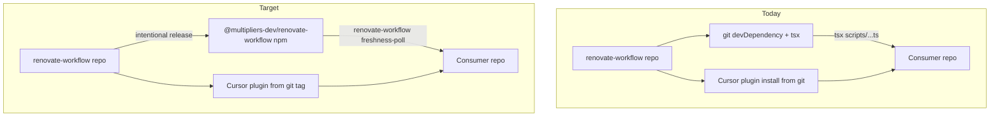
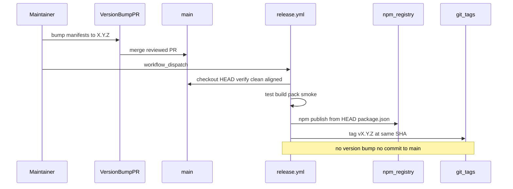

# Versioned npm package / CLI distribution for renovate-workflow

## Current state (inspected on `main`)

| Area | Finding |
| --- | --- |
| Version | `0.2.0` aligned across [`package.json`](package.json), [`plugin.json`](plugin.json), [`.cursor-plugin/plugin.json`](.cursor-plugin/plugin.json) — enforced by [`scripts/validate-plugin-structure.test.ts`](scripts/validate-plugin-structure.test.ts) |
| npm today | `"private": true`; no `bin`, `exports`, or build; ships raw `.ts` via git install |
| `files` field | `scripts`, `docs`, `.agents` — includes tests/fixtures; excludes plugin assets |
| Consumer CLI | `tsx node_modules/renovate-workflow/scripts/renovate-freshness-poll.ts` |
| Executable surface | [`scripts/renovate-freshness-poll.ts`](scripts/renovate-freshness-poll.ts) + [`scripts/lib/*`](scripts/lib/) |
| Plugin surface | `skills/`, `.agents/`, docs — git marketplace install only |
| Tags/releases | None; [`docs/versioning.md`](docs/versioning.md) explicitly forbids npm publish today |
| npm org / scope | **`@multipliers-dev` created** — org controlled by project owner; target package name `@multipliers-dev/renovate-workflow` is confirmed (not pending validation at first-release) |
| Live consumers | [codenames-ai-guesser](https://github.com/multipliers-dev/codenames-ai-guesser) (lockfile `0.1.0` commit), [portfolio](https://github.com/mastermichaelt/portfolio) (lockfile `0.2.0` commit) — both unpinned `github:multipliers-dev/renovate-workflow` |
| Skill mismatch | Classifier skill shells out to `npm exec -- tsx scripts/renovate-freshness-poll.ts` (repo-root path) instead of the consumer script boundary |



---

## Completed prerequisites

| Prerequisite | Status |
| --- | --- |
| npm org / scope `@multipliers-dev` | **Done** — created and controlled by project owner |
| Target publish name `@multipliers-dev/renovate-workflow` | **Confirmed** — not a namespace to validate during `first-release` |

**`first-release` (complete, October 2026):** `@multipliers-dev/renovate-workflow@0.3.0` published via Trusted Publishing/OIDC (`release.yml` dispatch); matching `v0.3.0` git tag and GitHub Release created; disposable bootstrap stage rejected; package consumed successfully by Codenames (`consumer-migrate-codenames` merged). Bootstrap procedure archived in [`docs/archive/trusted-publishing-bootstrap-0.3.0.md`](../docs/archive/trusted-publishing-bootstrap-0.3.0.md).

---

## Trusted Publishing investigation (2026-10-07)

Official npm docs now recommend [Trusted Publishing](https://docs.npmjs.com/trusted-publishers/) (GitHub Actions OIDC) over long-lived `NPM_TOKEN` automation tokens. Findings from npm + GitHub primary sources:

| Question | Answer |
| --- | --- |
| Configure Trusted Publisher **before** first publish? | **No** — package must already exist on the registry ([`npm trust` prerequisites](https://docs.npmjs.com/cli/v11/commands/npm-trust/), [trusted publishing setup](https://docs.npmjs.com/trusted-publishers/)) |
| Can `0.3.0` be the first **OIDC**-published version? | **Yes**, after bootstrap creates the package on npm **without occupying the `0.3.0` semver slot** (recommended: validate `0.3.0` in checkout → `npm pack` → `npm run bootstrap:tarball` disposable `0.0.1` tarball via isolated `npm pack` — **not** manual `tar -czf` (registry E415 `invalid path: package/`) → `npm stage publish <tarball>`; checkout stays `0.3.0`; post-release `npm stage reject` for pending `0.0.1`) |
| Why not `npm pkg set version=0.0.1` in the checkout? | **`prepack` runs `npm test`**, which enforces aligned `0.3.0` manifests — fails safely before registry mutation. Bootstrap must use an isolated packed artifact, not mutate the canonical tree |
| `npm stage publish` directory vs tarball? | **Both supported** (`<package-spec>`). Directory runs lifecycle scripts; **tarball does not** — use tarball for bootstrap after `0.3.0` validation |
| npm CLI for `npm stage`? | **≥ 11.15.0** ([staged publishing](https://docs.npmjs.com/staged-publishing/)); run `sh scripts/npm-stage-cli-preflight.sh` before bootstrap — Node version alone is insufficient |
| Pending staged `0.3.0` vs OIDC `npm publish` of `0.3.0`? | **Blocks direct publish** — staged and published versions share one semver index ([`npm stage` key behaviors](https://docs.npmjs.com/cli/v12/commands/npm-stage/)). Direct publish does **not** supersede; must `npm stage reject` (2FA) first, or never stage `0.3.0` |
| Provenance on OIDC publish? | **Automatic** for public package + public GitHub repo — no `--provenance` flag ([trusted publishing § Automatic provenance](https://docs.npmjs.com/trusted-publishers/#automatic-provenance-generation)) |
| Trusted Publisher expiry | New configuration must complete its **first successful publish within 48 hours** or it expires ([npm docs](https://docs.npmjs.com/trusted-publishers/#trusted-publisher-configuration-expiry)) |

### npm Trusted Publisher settings (`@multipliers-dev/renovate-workflow`)

Configure **after** bootstrap, via package **Settings → Trusted publishing → GitHub Actions**:

| Field | Value |
| --- | --- |
| Organization or user | `multipliers-dev` |
| Repository | `renovate-workflow` |
| Workflow filename | `release.yml` |
| Environment name | *(empty)* |
| Allowed actions | **`npm publish`** |

CLI: `npm trust github @multipliers-dev/renovate-workflow --file release.yml --repository multipliers-dev/renovate-workflow --allow-publish`

### GitHub Actions changes (implemented in `fix/trusted-publishing-release`)

| Change | Rationale |
| --- | --- |
| `permissions.id-token: write` | Required for OIDC ([npm trusted publishing](https://docs.npmjs.com/trusted-publishers/)) |
| Remove `NODE_AUTH_TOKEN` / `NPM_TOKEN` | OIDC replaces token auth |
| Node **24** in release job | npm recommends; ships npm ≥ 11.5.1 (OIDC minimum) |
| `package-manager-cache: false` | npm release example recommendation |
| **No** `registry-url` on `setup-node` | Empty `_authToken` line blocks OIDC when no token set ([setup-node#1551](https://github.com/actions/setup-node/issues/1551)) |
| No `--provenance` on `npm publish` | Automatic under Trusted Publishing |

Preserves: publish-only model, all §8 preflights, concurrency, packed-artifact smoke, partial-release recovery semantics.

---

## Design decisions

### 1. Package name and visibility

**Confirmed target:** `@multipliers-dev/renovate-workflow` (scoped public package on the existing `@multipliers-dev` npm org).

| Phase | `package.json` `"name"` | `files` / install layout | Rationale |
| --- | --- | --- | --- |
| `package-cli` + `release-infrastructure` | `renovate-workflow` (unscoped) | `dist/`, `scripts/` (legacy), `README.md` | Git consumers resolve `node_modules/renovate-workflow/scripts/...` |
| `version-bump-0.3.0` + `first-release` | `@multipliers-dev/renovate-workflow` | same transition allowlist (still includes `scripts/`) | Scoped publish name; Codenames/Portfolio not migrated yet |
| `legacy-scripts-cleanup` (after both consumer migrations) | `@multipliers-dev/renovate-workflow` | `dist/`, `README.md` only | Stable npm API — compiled CLI only |

Plugin manifest `name` fields (`plugin.json`, `.cursor-plugin/plugin.json`) stay `renovate-workflow` throughout.

**Git consumer compatibility (name + package layout):** Codenames and Portfolio install this repo as an unpinned git devDependency and invoke:

```text
tsx node_modules/renovate-workflow/scripts/renovate-freshness-poll.ts
```

Keeping `"name": "renovate-workflow"` alone is **not sufficient** — npm/git installs honor `package.json` `files`, so narrowing the allowlist to `dist/` only would omit `scripts/` and break existing consumers on the next lockfile refresh. Therefore:

- **`package-cli` through `first-release`:** include `scripts/` in the `files` allowlist alongside `dist/` and minimal package docs. Document `scripts/` as a **temporary legacy git-consumer compatibility surface**, not part of the intended stable npm API. Do **not** commit `dist/` to git merely to support git consumers; `dist/` is built at pack/publish time via `prepack`. Do **not** repurpose `prepare` into a compatibility build — it remains hook setup only.
- **`package-cli` and `release-infrastructure`:** keep `"name": "renovate-workflow"` (unscoped).
- **`version-bump-0.3.0`:** atomically transition to `"name": "@multipliers-dev/renovate-workflow"` immediately before `first-release`, in the same reviewed PR as the `0.3.0` version bump and `"private": false` — **still keep `scripts/` in `files`** until both consumers migrate.
- **Do not remove `scripts/` when Codenames alone migrates** — Portfolio still depends on the legacy path until slice 8.
- **`legacy-scripts-cleanup`:** remove `scripts/` from the published tarball allowlist only after **both** Codenames and Portfolio have migrated to `@multipliers-dev/renovate-workflow` and the compiled CLI.

Do **not** publish during plan-review, package-cli, release-infrastructure, or version-bump-0.3.0 slices.

### 2. What ships in the npm tarball

**Stable npm API (target — `legacy-scripts-cleanup` slice onward):**

- Compiled `dist/` (CLI + runtime lib)
- `package.json` with `bin`, `engines`, runtime `dependencies` (`yaml`)
- Minimal `README.md` (CLI usage only; link to GitHub for plugin adoption)

**Transition allowlist (`package-cli` through `first-release`):**

```json
"files": ["dist", "scripts", "README.md"]
```

- **`scripts/`** — temporary legacy surface so git-installed Codenames/Portfolio can keep executing `tsx node_modules/renovate-workflow/scripts/renovate-freshness-poll.ts` until both consumer migration slices land. **Not** documented as supported npm API; new adopters use the compiled `renovate-workflow` CLI after migration.
- Exclude test/fixture noise from the shipped tree where practical (e.g. omit `scripts/**/*.test.ts`, `scripts/fixtures/` via `.npmignore` or narrow `files` patterns if needed — implementation detail left to `package-cli`, but the runtime CLI entry + `scripts/lib/` must remain reachable).

**Never ship:**

- `skills/`, `.cursor-plugin/`, `plugin.json` (plugin channel)
- `.agents/`, full `docs/` (plugin / git clone)
- `src/` placeholder

**Do not commit `dist/`** to git for git-consumer support — build via `prepack` / release workflow only.

`check-agent-plugins-spec-drift` remains **repository maintainer tooling only** — not part of the consumer npm surface.

### 3. Build and CLI boundary

**Recommendation:** `tsc` emit (least complicated robust path).

- Add [`scripts/tsconfig.build.json`](scripts/tsconfig.build.json): `noEmit: false`, `outDir: ../dist`, `rootDir: .`, preserve NodeNext ESM `.js` import specifiers
- Add root script: `"build": "tsc -p scripts/tsconfig.build.json"`
- Add `"prepack": "npm run build && npm test"` (local `npm pack` / publish gate — builds `dist/` at pack time; does not replace `prepare`, which stays hook setup only)

**Package contract (`package-cli` slice — unscoped name retained for git compatibility):**

```json
{
  "name": "renovate-workflow",
  "private": true,
  "bin": {
    "renovate-workflow": "./dist/cli.js"
  }
}
```

**Release manifest (`version-bump-0.3.0` slice — scoped rename + publish readiness):**

```json
{
  "name": "@multipliers-dev/renovate-workflow",
  "version": "0.3.0",
  "bin": {
    "renovate-workflow": "./dist/cli.js"
  }
}
```

`dist/cli.js` dispatches subcommands:

| Subcommand | Maps to | Consumer script |
| --- | --- | --- |
| `freshness-poll` | today's freshness poll | `renovate-workflow freshness-poll` |
| `--help` / `-h` | usage | `renovate-workflow --help` |

Preserve existing flags (`--repo`, `--pr`, `--expected-head`, debug overrides). Add `--help` on subcommand.

Consumers should **not** need `tsx`. Runtime requires Node satisfying `engines` (recommend `>=22.22.1`, aligned with codenames/portfolio).

**Skill/doc fix (package-cli slice):** update [`skills/renovate-classifier/SKILL.md`](skills/renovate-classifier/SKILL.md) §2.7 and [`skills/renovate-loop/verification.md`](skills/renovate-loop/verification.md) to invoke:

```bash
npm run renovate:freshness-poll -- --repo {owner}/{repo} --pr {N} --expected-head {sha}
```

This is the stable consumer boundary regardless of npm vs local dev implementation.

### 4. Releases ≠ repository changes

| Category | Examples | Version-bump PR? | Release (publish + tag)? |
| --- | --- | --- | --- |
| **Repository maintenance** | Vitest/Action pins, test refactors, drift workflow, internal docs, plugin structure tests, CI-only | No | No |
| **Consumer-facing (accumulated)** | CLI fixes, skill/agent/rubric changes, schema/runtime contract changes, shipped files, runtime deps | Yes — in a normal reviewed PR | Yes — only after that PR merges, via manual dispatch |
| **Release-only housekeeping** | Changelog wording, release notes draft | No (unless version not yet bumped) | No |

**Rules:**

- Merging to `main` never publishes.
- Version bumps happen only in reviewed PRs that update all three aligned manifests together.
- The release workflow never bumps versions and never commits back to `main`.
- Repository/plugin maintenance may accumulate on `main` without a release.
- Once an intentional version is cut, **npm and plugin always move together** — no git tag / plugin release at version *V* without publishing npm version *V*.

### 5. Versioning semantics (stay pre-1.0)

Remain **`0.x`** until CLI contract stabilizes.

| Bump | When |
| --- | --- |
| **Patch** | Bug fix in `freshness-poll` output/behavior; dependency patch that does not change CLI contract |
| **Minor** | New subcommand; additive CLI flags; backward-compatible JSON fields |
| **Major** | Rename/remove flags; breaking JSON shape; Node engine floor increase; removing a subcommand |

**Consumer version range recommendation:** `^0.3.0` after first npm release.

- For `0.x`, npm caret is restrictive: `^0.3.0` → `>=0.3.0 <0.4.0` (patch-only within minor).
- Do **not** recommend bare `github:…` or floating `main` after migration.
- Exact pins acceptable for maximum control; caret + policy review is the default.

**First npm version:** **`0.3.0`** — bumped in a reviewed PR (`version-bump-0.3.0` slice), then published/tagged from that exact merged commit.

### 6. Plugin vs npm version coupling

**One coherent repository version** across `package.json`, `plugin.json`, `.cursor-plugin/plugin.json` (keep existing [`scripts/validate-plugin-structure.test.ts`](scripts/validate-plugin-structure.test.ts)).

| Artifact | Distribution | Version meaning |
| --- | --- | --- |
| Cursor plugin | Git tag / marketplace import | Skills, agents, rubric at version *V* |
| npm package | Registry | CLI/runtime contract at version *V* |

Consumers install through different channels, but **version *V* always means the same repository commit** for both. There is no supported path to cut a git tag / plugin release at *V* without publishing npm *V*. Maintenance may land on `main` without a release; when a release is cut, npm publish + git tag + GitHub Release all reference the same `main` HEAD commit whose manifests already read *V*.

### 7. Self-hosting / dogfood (no circular npm dep)

[`renovate-workflow`](package.json) itself should **not** add a devDependency on `@multipliers-dev/renovate-workflow`.

| Context | Invocation |
| --- | --- |
| **This repo (dev/CI)** | `npm run renovate:freshness-poll` → `tsx scripts/renovate-freshness-poll.ts` (source) |
| **Packed-artifact test** | `npm pack` + temp install exercises compiled `bin` |
| **External consumers** | `renovate-workflow freshness-poll` from published package |

Document in [`AGENTS.md`](AGENTS.md) and [`docs/versioning.md`](docs/versioning.md).

### 8. Release workflow (lightweight, intentional)

**Recommendation:** two-step model — **version bump in PR**, **publish in workflow** — no Changesets.

#### Step A — Version bump (normal reviewed PR)

```text
consumer-facing changes accumulate on main (no release yet)
        ↓
reviewed PR bumps package.json + plugin.json + .cursor-plugin/plugin.json to X.Y.Z
(for 0.3.0: also renames package.json name to @multipliers-dev/renovate-workflow and removes private)
        ↓
PR merges → main HEAD manifests read X.Y.Z
```

The release workflow does **not** perform this step.

#### Step B — Publish (manual `workflow_dispatch` only)

```text
maintainer dispatches release.yml against current main
        ↓
pre-flight safeguards (all must pass — see below)
        ↓
npm ci → npm test → npm run typecheck → npm run build
        ↓
packed-artifact smoke test (renovate-workflow freshness-poll --help)
        ↓
npm publish --access public
        ↓
git tag vX.Y.Z at that exact commit + GitHub Release
```

`npm publish` reads **name and version from the verified checked-out `package.json`** — do not pass a package coordinate on the CLI. Preflight asserts the scoped name and aligned version before publish.

The release workflow **must not** bump versions, edit manifests, or commit/push back to `main`.

#### Release safeguards (blocking, in workflow)

| Check | Purpose |
| --- | --- |
| **Clean, current `main`** | Checkout `main`; working tree clean; `HEAD` matches `origin/main` (no unpushed local-only state) |
| **Aligned manifests** | `package.json`, `plugin.json`, `.cursor-plugin/plugin.json` all report the same `version`; `package.json` `"name"` matches expected scoped publish name (reuse validate-plugin-structure logic) |
| **npm version absent** | `npm view` for the scoped name at `package.json` version fails / version not published |
| **git tag absent** | `vX.Y.Z` tag does not already exist on remote |
| **Packed artifact smoke** | `npm pack` + temp install + `renovate-workflow freshness-poll --help` succeeds |
| **Tag ↔ publish commit** | After publish, create `vX.Y.Z` pointing at the **same commit SHA** that was checked out and published; record SHA in GitHub Release body |

Additional CI safeguards (PR time):

- `npm publish --dry-run` on PRs touching publish config
- `prepack` runs build + tests
- `files` allowlist + pack manifest test

Require `workflow_dispatch` confirmation input (e.g. type `publish` and the exact version read from manifests).

**Not in scope:** auto-publish on merge, version bumps in release workflow, commits back to `main`, release-please, Changesets, plugin-only tags without npm.

### 9. Package validation (artifact tests)

**`package-cli` slice — dual distribution paths:**

1. **Packed CLI path (new npm API):** `npm pack` + temp install + `npx renovate-workflow freshness-poll --help` succeeds; tarball includes `dist/**` and packed `package.json` `"name"` is `renovate-workflow`
2. **Git-layout compatibility path (legacy):** fixture simulating git/package install layout can execute `tsx node_modules/renovate-workflow/scripts/renovate-freshness-poll.ts --help` (or equivalent path assertion against packed tarball tree) — proves `scripts/renovate-freshness-poll.ts` remains present without committing `dist/` to git
3. **Pack manifest test** — transition allowlist includes `scripts/` runtime paths; excludes `skills/`, `.agents/`, `*.test.ts` where configured
4. **Existing Vitest** — continue testing source modules (`scripts/**/*.test.ts`)

**`version-bump-0.3.0` slice (scoped release manifest):**

5. **Release manifest pack test** — after scoped rename + version bump, `npm pack` asserts `"name": "@multipliers-dev/renovate-workflow"`, `"version": "0.3.0"`, and **still includes `scripts/`** for remaining git consumers

**`legacy-scripts-cleanup` slice (post-migration):**

6. **Narrow allowlist test** — `npm pack` tarball contains `dist/**` + docs only; **no** `scripts/`; packed CLI smoke still passes

### 10. Renovate interaction in consumers

After migration, Renovate sees a normal npm devDependency.

**Policy classification:** add explicit package entry in [`.agents/renovate-policy.yml`](.agents/renovate-policy.yml) (both consumers), e.g.:

```yaml
packages:
  - name: "@multipliers-dev/renovate-workflow"
    risk_class: high_touch_tooling
```

**Do not** enable silent auto-merge for this package — it controls dependency-governance execution. `high_touch_tooling` routes to investigation/human review per existing ladder semantics. Remove `renovate-workflow` from unlisted examples once explicitly listed.

**Renovate bot config:** no special grouping required; default individual PRs are appropriate.

### 11. Rollout sequence and rollback

```text
1. plan-review (plan-only PR)          ← this slice
2. package-cli                         ← build, bin, transition allowlist (dist + scripts), dual-path tests
3. release-infrastructure              ← publish-only workflow + safeguards, doc drafts
4. version-bump-0.3.0                  ← scoped rename + manifests → 0.3.0; keep scripts/ in files
5. first-release                       ← publish still includes scripts/ (consumers not migrated)
6. consumer-migrate-codenames          ← first external consumer; do NOT remove scripts/ here
7. e2e babysit verification            ← /renovate-loop --babysit on codenames
8. consumer-migrate-portfolio            ← second consumer; scripts/ still required until this merges
9. plan-closure                        ← archive plan, finalize docs; record legacy-scripts-cleanup
10. legacy-scripts-cleanup             ← follow-up PR: narrow files to dist/ + docs only
```

**Rollout invariant:** `scripts/` stays in the published/git-install package surface from `package-cli` through `first-release` and until **both** consumer migration slices (6 and 8) have merged. Codenames-only migration does not authorize removal.

**Rollback:**

- **After npm migration (preferred):** revert the consumer to the last known-good published npm version (exact pin or prior caret range); do not use a floating git dependency.
- **Emergency git+tsx rollback (pre-migration or pre-scoped era only):** pin the git devDependency to a **known commit or tag** whose `package.json` still has `"name": "renovate-workflow"` (e.g. last `0.2.x` commit before `version-bump-0.3.0` merged), then keep `tsx node_modules/renovate-workflow/scripts/renovate-freshness-poll.ts`. **Invalid for `v0.3.0+`:** tags at `0.3.0` and later ship the scoped name and install under `node_modules/@multipliers-dev/renovate-workflow`, so `node_modules/renovate-workflow/...` paths will not work.
- **Registry:** forward-fix via new version-bump PR + publish (do not rely on unpublish)
- **Plugin:** reinstall from prior unified tag (npm and plugin always share version *V*)

---

## Recommended execution authority

| Slice | Authority | Agent instruction |
| --- | --- | --- |
| plan-review | Plan-only PR | Do not implement. Stop after opening the plan-only PR. |
| package-cli | Open PR only | Do not merge. Stop after opening the PR. |
| release-infrastructure | Open PR only | Do not merge. Stop after opening the PR. |
| version-bump-0.3.0 | Open PR only | Do not merge. Stop after opening the PR. Scoped rename + version bump only; no publish, no tag. |
| first-release | Merge granted | Publish/tag/release only after version-bump-0.3.0 merged; workflow must not bump versions. |
| consumer-migrate-codenames | Open PR only | Do not merge. Stop after opening the PR. |
| e2e-babysit-codenames | Manual verification gate | Report verdict; no PR unless findings require fixes. |
| consumer-migrate-portfolio | Open PR only | Do not merge. Stop after opening the PR. |
| plan-closure | Open PR only | Do not merge. Stop after opening the PR. Docs-only — record `legacy-scripts-cleanup` follow-up. |
| legacy-scripts-cleanup | Open PR only | Do not merge. Stop after opening the PR. Only after both consumer migrations merged. |



---

## Slice breakdown

### plan-review — Plan-only PR

| | |
| --- | --- |
| **Authority** | Plan-only PR — stop after opening PR; no implementation |
| **Scope** | Add [`.cursor/plans/2026-10-07-npm-package-distribution.plan.md`](.cursor/plans/2026-10-07-npm-package-distribution.plan.md) (this plan) |
| **Files** | `.cursor/plans/2026-10-07-npm-package-distribution.plan.md` only |
| **Verification** | PR contains only plan artifact; no package.json / workflow changes |
| **External effects** | None |

### package-cli — Stable package boundary (no publish)

| | |
| --- | --- |
| **Authority** | Open PR only |
| **Prerequisites** | plan-review merged |
| **Scope** | Build pipeline, `bin`, transition `files` allowlist (`dist`, `scripts`, `README.md`), pack + **dual-path** smoke tests, skill boundary fix. **Keep** `"name": "renovate-workflow"` and `"private": true`. Preserve legacy `scripts/` path for git consumers — unscoped name alone is insufficient. Do not commit `dist/`; do not repurpose `prepare` for compatibility builds |
| **Expected files** | `package.json` (unscoped `name`, `bin`, transition `files`, `engines`; version `0.2.0`), `scripts/tsconfig.build.json`, `scripts/cli.ts`, `dist/` gitignored, `.npmignore` or narrow patterns as needed, `scripts/pack-manifest.test.ts`, `scripts/fixtures/npm-consumer/` (packed CLI), `scripts/fixtures/git-consumer/` (legacy tsx path), skill/doc updates, [`examples/adopt-stub/package.json`](examples/adopt-stub/package.json) (unchanged git dep until migration) |
| **Verification** | `npm test`, `npm run typecheck`, `npm run build`; (1) packed CLI `renovate-workflow freshness-poll --help`; (2) git-layout fixture `tsx .../scripts/renovate-freshness-poll.ts --help`; pack manifest includes `scripts/` runtime paths and unscoped `name` |
| **External effects** | None |
| **Rollback** | Revert PR |

### release-infrastructure — Publish mechanism (no publish)

| | |
| --- | --- |
| **Authority** | Open PR only |
| **Prerequisites** | package-cli merged |
| **Scope** | `.github/workflows/release.yml` (`workflow_dispatch`, **publish-only** — `npm publish --access public` from checked-out `package.json`; no version bump, no commit to `main`), all release safeguards from §8, optional `publish-dry-run` CI job on PRs, update [`docs/versioning.md`](docs/versioning.md) + [`docs/adopt.md`](docs/adopt.md) + [`docs/distribution-discovery.md`](docs/distribution-discovery.md) documenting two-step release model, confirmed `@multipliers-dev` scope, and unified version policy. **Superseded for auth:** Trusted Publishing correction PR replaces `NPM_TOKEN` with OIDC (see Trusted Publishing investigation above) |
| **Expected files** | `.github/workflows/release.yml`, docs above, `README.md` publish section |
| **Verification** | `npm publish --dry-run` in CI passes; release workflow reads version from manifests only; workflow contains no version-bump or git-commit steps |
| **External effects** | None |
| **Rollback** | Revert PR |

### version-bump-0.3.0 — Reviewed manifest bump (no publish)

| | |
| --- | --- |
| **Authority** | Open PR only |
| **Prerequisites** | release-infrastructure merged |
| **Scope** | Atomic release manifest prep immediately before `first-release`: rename `package.json` `"name"` to `@multipliers-dev/renovate-workflow`; bump aligned manifests to `0.3.0`; remove `"private": true`; **retain `scripts/` in `files`** (Portfolio/Codenames not migrated yet) |
| **Expected files** | `package.json` (scoped `name`, version `0.3.0`, transition `files` still includes `scripts/`), aligned plugin manifest versions, release-manifest pack test, optional `CHANGELOG.md` entry |
| **Verification** | `npm test` (validate-plugin-structure passes); `npm pack` asserts scoped `name`, version `0.3.0`, and `scripts/` still present; dual-path smoke still passes; **no** npm publish; **no** git tag |
| **External effects** | None |
| **Rollback** | Revert PR before first-release |

### first-release — Publish v0.3.0 from merged commit

**Shipped (October 2026).** `@multipliers-dev/renovate-workflow@0.3.0` on npm via Trusted Publishing/OIDC; `v0.3.0` tag and GitHub Release at the published commit; disposable bootstrap stage rejected; Codenames consuming the published package.

| | |
| --- | --- |
| **Authority** | **Merge granted** (or explicit human maintainer dispatch outside agent) — external side effect |
| **Prerequisites** | `@multipliers-dev` npm org (done); `version-bump-0.3.0` merged; `sh scripts/npm-stage-cli-preflight.sh` passed; **one-time registry bootstrap** completed (`0.3.0` validation + `npm pack` in checkout → disposable `0.0.1` tarball → `npm stage publish`; checkout unchanged at `0.3.0`; must **not** leave staged `0.3.0` pending; see [archived bootstrap doc](../docs/archive/trusted-publishing-bootstrap-0.3.0.md)); npm **Trusted Publisher** configured for `release.yml` within 48h of creation; `main` HEAD manifests read `0.3.0` with scoped `"name"`; after successful OIDC `0.3.0`, reject pending bootstrap stage |
| **Scope** | Manually dispatch `release.yml` against current `main` — OIDC `npm publish --access public` (provenance automatic), tag `v0.3.0`, create GitHub Release for the **exact merged commit** (no version/name edits in workflow). Published tarball still includes transition `scripts/` surface |
| **Verification** | All §8 safeguards pass; `npm view @multipliers-dev/renovate-workflow version` → `0.3.0`; temp `npm i` + `renovate-workflow freshness-poll --help`; remote tag `v0.3.0` points at published commit SHA (recorded in release notes). Git consumers not yet migrated may still need pinned pre-scoped commits — see §11 rollback |
| **External effects** | **npm publish**, git tag, GitHub Release |
| **Rollback** | Forward-fix via new version-bump PR + publish; consumers stay on git dep until migrated |

### consumer-migrate-codenames

| | |
| --- | --- |
| **Authority** | Open PR only |
| **Prerequisites** | first-release verified |
| **Scope** | Replace git dep + tsx script in [`codenames-ai-guesser/package.json`](https://github.com/multipliers-dev/codenames-ai-guesser); update `AGENTS.md`, `README.md`; add explicit `packages:` entry in `.agents/renovate-policy.yml`; remove `tsx` if no longer needed elsewhere. **Do not** remove `scripts/` from renovate-workflow package `files` — Portfolio still on legacy path |
| **Verification** | `npm run renovate:freshness-poll -- --help`; lockfile resolves npm version; existing CI passes |
| **External effects** | None |
| **Rollback** | Revert to last known-good published npm version (preferred); see §11 rollback options |

### e2e-babysit-codenames

| | |
| --- | --- |
| **Authority** | Manual verification gate (non-PR) or documented in migration PR |
| **Prerequisites** | consumer-migrate-codenames merged |
| **Scope** | Run `/renovate-loop --babysit` against a real open Renovate PR on codenames |
| **Verification** | Freshness poll invoked via new CLI; JSON outcome recorded in loop report |
| **External effects** | None |

### consumer-migrate-portfolio

| | |
| --- | --- |
| **Authority** | Open PR only |
| **Prerequisites** | e2e-babysit-codenames passed |
| **Scope** | Same mechanical migration as codenames; update `.agents/renovate-policy.yml`; OKF fixture paths if they reference old script path |
| **Verification** | `npm run renovate:freshness-poll -- --help`; CI passes |
| **External effects** | None |

### plan-closure — Docs-only archive

| | |
| --- | --- |
| **Authority** | Open PR only (docs-only — no `scripts/` removal here) |
| **Prerequisites** | All implementation slices through `consumer-migrate-portfolio` merged |
| **Scope** | `# Shipped` note; move plan to `.cursor/plans/archive/`; mark slice todos completed; document `legacy-scripts-cleanup` as required follow-up PR to narrow `files` to stable npm API |
| **External effects** | None |

### legacy-scripts-cleanup — Narrow published surface (follow-up)

| | |
| --- | --- |
| **Authority** | Open PR only |
| **Prerequisites** | `consumer-migrate-codenames` and `consumer-migrate-portfolio` merged; both consumers on `@multipliers-dev/renovate-workflow` compiled CLI |
| **Scope** | Remove `scripts/` from `package.json` `files` allowlist; update pack manifest tests; document removal of legacy git+tsx path in `docs/adopt.md` / `docs/versioning.md` |
| **Expected files** | `package.json` (`files`: `dist`, `README.md` only), pack tests, docs |
| **Verification** | `npm pack` excludes `scripts/`; packed CLI smoke passes; no remaining consumer depends on `node_modules/renovate-workflow/scripts/...` |
| **External effects** | None |
| **Rollback** | Revert PR; restore transition allowlist if a consumer still needs legacy path |

---

## Target consumer experience

```json
{
  "devDependencies": {
    "@multipliers-dev/renovate-workflow": "^0.3.0"
  },
  "scripts": {
    "renovate:freshness-poll": "renovate-workflow freshness-poll"
  }
}
```

Plugin install unchanged: import marketplace from `https://github.com/multipliers-dev/renovate-workflow` (optionally document pinning marketplace to tag `v0.3.0` after release).

---

## Agent prompts (copy/paste for Cursor)

### plan-review

```text
@.cursor/plans/2026-10-07-npm-package-distribution.plan.md

Execute only plan-review.

Authority: Plan-only PR — commit the plan artifact and open a PR for review; do not implement package-cli or later slices.

Topology: start from latest origin/main; branch contains only the plan file; PR base must be main.

Deliverables: .cursor/plans/2026-10-07-npm-package-distribution.plan.md. Mark plan-review completed in plan frontmatter in this PR.

Verification: PR diff is plan-only; no package.json, workflow, or publish changes.
```

### package-cli

```text
@.cursor/plans/2026-10-07-npm-package-distribution.plan.md

Implement slice package-cli only. Do not start release-infrastructure or later slices. Do not publish to npm.

Authority: Open PR only — implement and open the PR; do not merge.

Topology: start from latest origin/main; branch represents only this slice; PR base must be main.

Deliverables: compiled dist build; renovate-workflow bin with freshness-poll subcommand; transition files allowlist (dist + scripts + README); keep package.json name as renovate-workflow (unscoped); dual-path tests (packed CLI + legacy tsx scripts path); document scripts/ as temporary legacy surface; do not commit dist/ or repurpose prepare. Mark package-cli completed in plan frontmatter in this PR.

Verification: npm test, npm run typecheck, npm run build; (1) packed CLI renovate-workflow freshness-poll --help; (2) git-layout fixture tsx .../scripts/renovate-freshness-poll.ts --help; pack manifest includes scripts/ and unscoped name.
```

### release-infrastructure

```text
@.cursor/plans/2026-10-07-npm-package-distribution.plan.md

Implement slice release-infrastructure only. Prerequisite: package-cli merged. Do not publish to npm.

Authority: Open PR only — implement and open the PR; do not merge.

Topology: start from latest origin/main; branch represents only this slice; PR base must be main.

Deliverables: workflow_dispatch publish-only release workflow (npm publish --access public from checked-out package.json; no version bump, no commit to main), all §8 release safeguards, dry-run CI, docs/versioning.md + docs/adopt.md + docs/distribution-discovery.md updates documenting completed @multipliers-dev org, two-step release, and unified npm+plugin version policy. Mark release-infrastructure completed in plan frontmatter in this PR.

Verification: npm publish --dry-run succeeds in CI; release workflow reads name/version from manifests at HEAD only; workflow contains no version-bump or push-to-main steps.
```

### version-bump-0.3.0

```text
@.cursor/plans/2026-10-07-npm-package-distribution.plan.md

Implement slice version-bump-0.3.0 only. Prerequisite: release-infrastructure merged. Do not publish to npm or create tags.

Authority: Open PR only — implement and open the PR; do not merge.

Topology: start from latest origin/main; branch represents only this slice; PR base must be main.

Deliverables: atomic release manifest — rename package.json to @multipliers-dev/renovate-workflow; bump aligned manifests to 0.3.0; remove private; retain scripts/ in files; add release-manifest pack test. Mark version-bump-0.3.0 completed in plan frontmatter in this PR.

Verification: npm test passes (validate-plugin-structure); npm pack asserts scoped name, version 0.3.0, and scripts/ still present; dual-path smoke still passes; no npm publish; no git tag.
```

### first-release

```text
@.cursor/plans/2026-10-07-npm-package-distribution.plan.md

Execute slice first-release only. Prerequisites: @multipliers-dev npm org (done); version-bump-0.3.0 merged; one-time registry bootstrap completed; npm Trusted Publisher configured for release.yml; main HEAD manifests read 0.3.0 with scoped name.

Authority: Merge granted — manually dispatch release workflow to OIDC-publish (npm publish --access public), tag, and create GitHub Release from the exact merged commit. Do not bump versions in the workflow.

Topology: release from current origin/main after version-bump-0.3.0 merge.

Deliverables: @multipliers-dev/renovate-workflow@0.3.0 on npm; git tag v0.3.0 at published commit SHA; GitHub Release with SHA recorded. Mark first-release completed in plan frontmatter.

Verification: all §8 safeguards pass; npm view shows 0.3.0; clean install + renovate-workflow freshness-poll --help; remote tag v0.3.0 points at published commit.
```

### consumer-migrate-codenames

```text
@.cursor/plans/2026-10-07-npm-package-distribution.plan.md

Implement slice consumer-migrate-codenames only in multipliers-dev/codenames-ai-guesser. Prerequisite: first-release verified.

Authority: Open PR only — implement and open the PR; do not merge.

Topology: start from latest origin/main; PR base must be main.

Deliverables: replace git renovate-workflow dep with @multipliers-dev/renovate-workflow, update script + AGENTS.md + policy package entry, remove tsx if unused. Do not remove scripts/ from renovate-workflow package files (Portfolio not migrated). Mark consumer-migrate-codenames completed in plan frontmatter in the renovate-workflow plan (separate PR in codenames marks its own work).

Verification: npm run renovate:freshness-poll -- --help; CI passes.
```

### consumer-migrate-portfolio

```text
@.cursor/plans/2026-10-07-npm-package-distribution.plan.md

Implement slice consumer-migrate-portfolio only in mastermichaelt/portfolio. Prerequisite: e2e-babysit-codenames passed.

Authority: Open PR only — implement and open the PR; do not merge.

Topology: start from latest origin/main; PR base must be main.

Deliverables: npm package migration per plan; policy package entry; OKF fixture path updates if needed. Mark consumer-migrate-portfolio completed in plan frontmatter.

Verification: npm run renovate:freshness-poll -- --help; CI passes.
```

### plan-closure

```text
@.cursor/plans/2026-10-07-npm-package-distribution.plan.md

Execute only plan-closure.

Authority: Open PR only — docs-only archive PR; do not merge.

Prerequisites: all implementation slices merged and marked completed.

Deliverables: # Shipped note, move plan to .cursor/plans/archive/2026-10-07-npm-package-distribution.plan.md, mark plan-closure completed, record legacy-scripts-cleanup as required follow-up (do not remove scripts/ in this docs-only PR).

Verification: all slice todos through consumer-migrate-portfolio completed; adopt.md teaches npm package path as primary; legacy-scripts-cleanup todo remains pending for follow-up implementation PR.
```

### legacy-scripts-cleanup

```text
@.cursor/plans/2026-10-07-npm-package-distribution.plan.md

Implement slice legacy-scripts-cleanup only. Prerequisites: consumer-migrate-codenames and consumer-migrate-portfolio merged; both on compiled CLI.

Authority: Open PR only — implement and open the PR; do not merge.

Topology: start from latest origin/main; branch represents only this slice; PR base must be main.

Deliverables: remove scripts/ from package.json files allowlist; narrow to dist + README; update pack tests and adoption docs. Mark legacy-scripts-cleanup completed in plan frontmatter in this PR.

Verification: npm pack excludes scripts/; packed CLI smoke passes; no consumer still depends on node_modules/renovate-workflow/scripts/ path.
```
