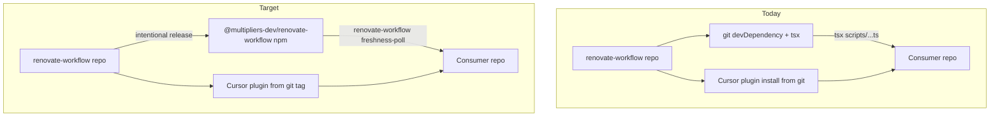
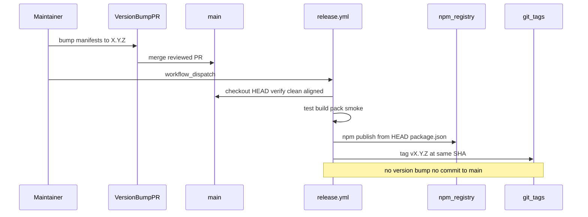

# Versioned npm package / CLI distribution for renovate-workflow

## Current state (inspected on `main`)

| Area | Finding |
| --- | --- |
| Version | `0.2.0` aligned across [`package.json`](package.json), [`plugin.json`](plugin.json), [`.cursor-plugin/plugin.json`](.cursor-plugin/plugin.json) — enforced by [`scripts/validate-plugin-structure.test.ts`](scripts/validate-plugin-structure.test.ts) |
| npm today | `"private": true`; no `bin`, `exports`, or build; ships raw `.ts` via git install |
| `files` field | `scripts`, `docs`, `.agents` — includes tests/fixtures; excludes plugin assets |
| Consumer CLI | `tsx node_modules/renovate-workflow/scripts/renovate-freshness-poll.ts` |
| Executable surface | [`scripts/renovate-freshness-poll.ts`](scripts/renovate-freshness-poll.ts) + [`scripts/lib/*`](scripts/lib/) |
| Plugin surface | `skills/`, `.agents/`, docs — git marketplace install only |
| Tags/releases | None; [`docs/versioning.md`](docs/versioning.md) explicitly forbids npm publish today |
| npm org / scope | **`@multipliers-dev` created** — org controlled by project owner; target package name `@multipliers-dev/renovate-workflow` is confirmed (not pending validation at first-release) |
| Live consumers | [codenames-ai-guesser](https://github.com/multipliers-dev/codenames-ai-guesser) (lockfile `0.1.0` commit), [portfolio](https://github.com/mastermichaelt/portfolio) (lockfile `0.2.0` commit) — both unpinned `github:multipliers-dev/renovate-workflow` |
| Skill mismatch | Classifier skill shells out to `npm exec -- tsx scripts/renovate-freshness-poll.ts` (repo-root path) instead of the consumer script boundary |



---

## Completed prerequisites

| Prerequisite | Status |
| --- | --- |
| npm org / scope `@multipliers-dev` | **Done** — created and controlled by project owner |
| Target publish name `@multipliers-dev/renovate-workflow` | **Confirmed** — not a namespace to validate during `first-release` |

**Remaining before `first-release`:** `NPM_TOKEN` GitHub Actions secret; `version-bump-0.3.0` merged with scoped release manifest.

---

## Design decisions

### 1. Package name and visibility

**Confirmed target:** `@multipliers-dev/renovate-workflow` (scoped public package on the existing `@multipliers-dev` npm org).

| Phase | `package.json` `"name"` | Rationale |
| --- | --- | --- |
| `package-cli` + `release-infrastructure` | `renovate-workflow` (unscoped) | Existing git consumers resolve `node_modules/renovate-workflow/scripts/...` |
| `version-bump-0.3.0` onward | `@multipliers-dev/renovate-workflow` | Scoped publish name; applied atomically with `0.3.0` release prep |

Plugin manifest `name` fields (`plugin.json`, `.cursor-plugin/plugin.json`) stay `renovate-workflow` throughout.

**Git consumer compatibility (defer scoped rename):** Codenames and Portfolio install this repo as an unpinned git devDependency and invoke `tsx node_modules/renovate-workflow/scripts/renovate-freshness-poll.ts`. Renaming `package.json` `"name"` on `main` before their migration would install under `node_modules/@multipliers-dev/renovate-workflow` and break that path. Therefore:

- **`package-cli` and `release-infrastructure`:** keep `"name": "renovate-workflow"` (unscoped).
- **`version-bump-0.3.0`:** atomically transition to `"name": "@multipliers-dev/renovate-workflow"` immediately before `first-release`, in the same reviewed PR as the `0.3.0` version bump and `"private": false`.

Do **not** publish during plan-review, package-cli, release-infrastructure, or version-bump-0.3.0 slices.

### 2. What ships in the npm tarball (narrow consumer package)

**Ship:**

- Compiled `dist/` (CLI + runtime lib)
- `package.json` with `bin`, `engines`, runtime `dependencies` (`yaml`)
- Minimal `README.md` (CLI usage only; link to GitHub for plugin adoption)

**Do not ship:**

- `skills/`, `.cursor-plugin/`, `plugin.json` (plugin channel)
- `scripts/**/*.test.ts`, `scripts/fixtures/` (dev/test only)
- `.agents/`, full `docs/` (plugin / git clone)
- `src/` placeholder

Replace current `files` with an explicit allowlist, e.g. `["dist", "README.md"]` (+ `LICENSE` if added).

`check-agent-plugins-spec-drift` remains **repository maintainer tooling only** — not part of the consumer npm surface.

### 3. Build and CLI boundary

**Recommendation:** `tsc` emit (least complicated robust path).

- Add [`scripts/tsconfig.build.json`](scripts/tsconfig.build.json): `noEmit: false`, `outDir: ../dist`, `rootDir: .`, preserve NodeNext ESM `.js` import specifiers
- Add root script: `"build": "tsc -p scripts/tsconfig.build.json"`
- Add `"prepack": "npm run build && npm test"` (local `npm pack` / publish gate)

**Package contract (`package-cli` slice — unscoped name retained for git compatibility):**

```json
{
  "name": "renovate-workflow",
  "private": true,
  "bin": {
    "renovate-workflow": "./dist/cli.js"
  }
}
```

**Release manifest (`version-bump-0.3.0` slice — scoped rename + publish readiness):**

```json
{
  "name": "@multipliers-dev/renovate-workflow",
  "version": "0.3.0",
  "bin": {
    "renovate-workflow": "./dist/cli.js"
  }
}
```

`dist/cli.js` dispatches subcommands:

| Subcommand | Maps to | Consumer script |
| --- | --- | --- |
| `freshness-poll` | today's freshness poll | `renovate-workflow freshness-poll` |
| `--help` / `-h` | usage | `renovate-workflow --help` |

Preserve existing flags (`--repo`, `--pr`, `--expected-head`, debug overrides). Add `--help` on subcommand.

Consumers should **not** need `tsx`. Runtime requires Node satisfying `engines` (recommend `>=22.22.1`, aligned with codenames/portfolio).

**Skill/doc fix (package-cli slice):** update [`skills/renovate-classifier/SKILL.md`](skills/renovate-classifier/SKILL.md) §2.7 and [`skills/renovate-loop/verification.md`](skills/renovate-loop/verification.md) to invoke:

```bash
npm run renovate:freshness-poll -- --repo {owner}/{repo} --pr {N} --expected-head {sha}
```

This is the stable consumer boundary regardless of npm vs local dev implementation.

### 4. Releases ≠ repository changes

| Category | Examples | Version-bump PR? | Release (publish + tag)? |
| --- | --- | --- | --- |
| **Repository maintenance** | Vitest/Action pins, test refactors, drift workflow, internal docs, plugin structure tests, CI-only | No | No |
| **Consumer-facing (accumulated)** | CLI fixes, skill/agent/rubric changes, schema/runtime contract changes, shipped files, runtime deps | Yes — in a normal reviewed PR | Yes — only after that PR merges, via manual dispatch |
| **Release-only housekeeping** | Changelog wording, release notes draft | No (unless version not yet bumped) | No |

**Rules:**

- Merging to `main` never publishes.
- Version bumps happen only in reviewed PRs that update all three aligned manifests together.
- The release workflow never bumps versions and never commits back to `main`.
- Repository/plugin maintenance may accumulate on `main` without a release.
- Once an intentional version is cut, **npm and plugin always move together** — no git tag / plugin release at version *V* without publishing npm version *V*.

### 5. Versioning semantics (stay pre-1.0)

Remain **`0.x`** until CLI contract stabilizes.

| Bump | When |
| --- | --- |
| **Patch** | Bug fix in `freshness-poll` output/behavior; dependency patch that does not change CLI contract |
| **Minor** | New subcommand; additive CLI flags; backward-compatible JSON fields |
| **Major** | Rename/remove flags; breaking JSON shape; Node engine floor increase; removing a subcommand |

**Consumer version range recommendation:** `^0.3.0` after first npm release.

- For `0.x`, npm caret is restrictive: `^0.3.0` → `>=0.3.0 <0.4.0` (patch-only within minor).
- Do **not** recommend bare `github:…` or floating `main` after migration.
- Exact pins acceptable for maximum control; caret + policy review is the default.

**First npm version:** **`0.3.0`** — bumped in a reviewed PR (`version-bump-0.3.0` slice), then published/tagged from that exact merged commit.

### 6. Plugin vs npm version coupling

**One coherent repository version** across `package.json`, `plugin.json`, `.cursor-plugin/plugin.json` (keep existing [`scripts/validate-plugin-structure.test.ts`](scripts/validate-plugin-structure.test.ts)).

| Artifact | Distribution | Version meaning |
| --- | --- | --- |
| Cursor plugin | Git tag / marketplace import | Skills, agents, rubric at version *V* |
| npm package | Registry | CLI/runtime contract at version *V* |

Consumers install through different channels, but **version *V* always means the same repository commit** for both. There is no supported path to cut a git tag / plugin release at *V* without publishing npm *V*. Maintenance may land on `main` without a release; when a release is cut, npm publish + git tag + GitHub Release all reference the same `main` HEAD commit whose manifests already read *V*.

### 7. Self-hosting / dogfood (no circular npm dep)

[`renovate-workflow`](package.json) itself should **not** add a devDependency on `@multipliers-dev/renovate-workflow`.

| Context | Invocation |
| --- | --- |
| **This repo (dev/CI)** | `npm run renovate:freshness-poll` → `tsx scripts/renovate-freshness-poll.ts` (source) |
| **Packed-artifact test** | `npm pack` + temp install exercises compiled `bin` |
| **External consumers** | `renovate-workflow freshness-poll` from published package |

Document in [`AGENTS.md`](AGENTS.md) and [`docs/versioning.md`](docs/versioning.md).

### 8. Release workflow (lightweight, intentional)

**Recommendation:** two-step model — **version bump in PR**, **publish in workflow** — no Changesets.

#### Step A — Version bump (normal reviewed PR)

```text
consumer-facing changes accumulate on main (no release yet)
        ↓
reviewed PR bumps package.json + plugin.json + .cursor-plugin/plugin.json to X.Y.Z
(for 0.3.0: also renames package.json name to @multipliers-dev/renovate-workflow and removes private)
        ↓
PR merges → main HEAD manifests read X.Y.Z
```

The release workflow does **not** perform this step.

#### Step B — Publish (manual `workflow_dispatch` only)

```text
maintainer dispatches release.yml against current main
        ↓
pre-flight safeguards (all must pass — see below)
        ↓
npm ci → npm test → npm run typecheck → npm run build
        ↓
packed-artifact smoke test (renovate-workflow freshness-poll --help)
        ↓
npm publish --access public
        ↓
git tag vX.Y.Z at that exact commit + GitHub Release
```

`npm publish` reads **name and version from the verified checked-out `package.json`** — do not pass a package coordinate on the CLI. Preflight asserts the scoped name and aligned version before publish.

The release workflow **must not** bump versions, edit manifests, or commit/push back to `main`.

#### Release safeguards (blocking, in workflow)

| Check | Purpose |
| --- | --- |
| **Clean, current `main`** | Checkout `main`; working tree clean; `HEAD` matches `origin/main` (no unpushed local-only state) |
| **Aligned manifests** | `package.json`, `plugin.json`, `.cursor-plugin/plugin.json` all report the same `version`; `package.json` `"name"` matches expected scoped publish name (reuse validate-plugin-structure logic) |
| **npm version absent** | `npm view` for the scoped name at `package.json` version fails / version not published |
| **git tag absent** | `vX.Y.Z` tag does not already exist on remote |
| **Packed artifact smoke** | `npm pack` + temp install + `renovate-workflow freshness-poll --help` succeeds |
| **Tag ↔ publish commit** | After publish, create `vX.Y.Z` pointing at the **same commit SHA** that was checked out and published; record SHA in GitHub Release body |

Additional CI safeguards (PR time):

- `npm publish --dry-run` on PRs touching publish config
- `prepack` runs build + tests
- `files` allowlist + pack manifest test

Require `workflow_dispatch` confirmation input (e.g. type `publish` and the exact version read from manifests).

**Not in scope:** auto-publish on merge, version bumps in release workflow, commits back to `main`, release-please, Changesets, plugin-only tags without npm.

### 9. Package validation (artifact tests)

**`package-cli` slice (unscoped name):**

1. **`npm pack --dry-run` / manifest test** — assert tarball contains only `dist/**`, `package.json`, `README.md`; assert excludes `skills/`, `scripts/`, `*.test.ts`; assert packed `package.json` `"name"` is still `renovate-workflow`
2. **Consumer smoke fixture** — e.g. [`scripts/fixtures/npm-consumer/`](scripts/fixtures/npm-consumer/):
   ```bash
   npm pack
   npm ci --prefix scripts/fixtures/npm-consumer  # installs packed tarball
   npx renovate-workflow freshness-poll --help
   ```
3. **Existing Vitest** — continue testing source modules (`scripts/**/*.test.ts`); add test that built `dist/cli.js` is invocable if feasible without flaking

**`version-bump-0.3.0` slice (scoped release manifest):**

4. **Release manifest pack test** — after scoped rename + version bump, `npm pack` tarball asserts `"name": "@multipliers-dev/renovate-workflow"` and `"version": "0.3.0"`

### 10. Renovate interaction in consumers

After migration, Renovate sees a normal npm devDependency.

**Policy classification:** add explicit package entry in [`.agents/renovate-policy.yml`](.agents/renovate-policy.yml) (both consumers), e.g.:

```yaml
packages:
  - name: "@multipliers-dev/renovate-workflow"
    risk_class: high_touch_tooling
```

**Do not** enable silent auto-merge for this package — it controls dependency-governance execution. `high_touch_tooling` routes to investigation/human review per existing ladder semantics. Remove `renovate-workflow` from unlisted examples once explicitly listed.

**Renovate bot config:** no special grouping required; default individual PRs are appropriate.

### 11. Rollout sequence and rollback

```text
1. plan-review (plan-only PR)          ← this slice
2. package-cli                         ← build, bin, pack tests; keep unscoped name
3. release-infrastructure              ← publish-only workflow + safeguards, doc drafts
4. version-bump-0.3.0                  ← scoped rename + manifests → 0.3.0 + remove private
5. first-release                       ← dispatch publish/tag/release from merged 0.3.0 commit
6. consumer-migrate-codenames          ← first external consumer
7. e2e babysit verification            ← /renovate-loop --babysit on codenames
8. consumer-migrate-portfolio
9. plan-closure                        ← archive plan, finalize docs
```

**Rollback:**

- **After npm migration (preferred):** revert the consumer to the last known-good published npm version (exact pin or prior caret range); do not use a floating git dependency.
- **Emergency git+tsx rollback (pre-migration or pre-scoped era only):** pin the git devDependency to a **known commit or tag** whose `package.json` still has `"name": "renovate-workflow"` (e.g. last `0.2.x` commit before `version-bump-0.3.0` merged), then keep `tsx node_modules/renovate-workflow/scripts/renovate-freshness-poll.ts`. **Invalid for `v0.3.0+`:** tags at `0.3.0` and later ship the scoped name and install under `node_modules/@multipliers-dev/renovate-workflow`, so `node_modules/renovate-workflow/...` paths will not work.
- **Registry:** forward-fix via new version-bump PR + publish (do not rely on unpublish)
- **Plugin:** reinstall from prior unified tag (npm and plugin always share version *V*)

---

## Recommended execution authority

| Slice | Authority | Agent instruction |
| --- | --- | --- |
| plan-review | Plan-only PR | Do not implement. Stop after opening the plan-only PR. |
| package-cli | Open PR only | Do not merge. Stop after opening the PR. |
| release-infrastructure | Open PR only | Do not merge. Stop after opening the PR. |
| version-bump-0.3.0 | Open PR only | Do not merge. Stop after opening the PR. Scoped rename + version bump only; no publish, no tag. |
| first-release | Merge granted | Publish/tag/release only after version-bump-0.3.0 merged; workflow must not bump versions. |
| consumer-migrate-codenames | Open PR only | Do not merge. Stop after opening the PR. |
| e2e-babysit-codenames | Manual verification gate | Report verdict; no PR unless findings require fixes. |
| consumer-migrate-portfolio | Open PR only | Do not merge. Stop after opening the PR. |
| plan-closure | Open PR only | Do not merge. Stop after opening the PR. |



---

## Slice breakdown

### plan-review — Plan-only PR

| | |
| --- | --- |
| **Authority** | Plan-only PR — stop after opening PR; no implementation |
| **Scope** | Add [`.cursor/plans/2026-10-07-npm-package-distribution.plan.md`](.cursor/plans/2026-10-07-npm-package-distribution.plan.md) (this plan) |
| **Files** | `.cursor/plans/2026-10-07-npm-package-distribution.plan.md` only |
| **Verification** | PR contains only plan artifact; no package.json / workflow changes |
| **External effects** | None |

### package-cli — Stable package boundary (no publish)

| | |
| --- | --- |
| **Authority** | Open PR only |
| **Prerequisites** | plan-review merged |
| **Scope** | Build pipeline, `bin`, narrow `files`, pack + smoke tests, skill boundary fix. **Keep** `"name": "renovate-workflow"` and `"private": true` so existing git consumers (`node_modules/renovate-workflow/scripts/...`) remain compatible through `release-infrastructure` |
| **Expected files** | `package.json` (unscoped `name`, `bin`, `files`, `engines`; version unchanged at `0.2.0`), `scripts/tsconfig.build.json`, `scripts/cli.ts` (new dispatcher), `dist/` gitignored, `.gitignore`, `scripts/pack-manifest.test.ts` (or similar), `scripts/fixtures/npm-consumer/`, `skills/renovate-classifier/SKILL.md`, `skills/renovate-loop/verification.md`, `AGENTS.md`, [`examples/adopt-stub/package.json`](examples/adopt-stub/package.json) (unchanged git dep shape until consumer migration) |
| **Verification** | `npm test`, `npm run typecheck`, `npm run build`, pack manifest test (asserts unscoped `name`), smoke `--help`; `npm pack` tarball `package.json` reports `"name": "renovate-workflow"` |
| **External effects** | None |
| **Rollback** | Revert PR |

### release-infrastructure — Publish mechanism (no publish)

| | |
| --- | --- |
| **Authority** | Open PR only |
| **Prerequisites** | package-cli merged |
| **Scope** | `.github/workflows/release.yml` (`workflow_dispatch`, **publish-only** — `npm publish --access public` from checked-out `package.json`; no version bump, no commit to `main`), all release safeguards from §8, document `NPM_TOKEN` secret requirement for `first-release`, optional `publish-dry-run` CI job on PRs, update [`docs/versioning.md`](docs/versioning.md) + [`docs/adopt.md`](docs/adopt.md) + [`docs/distribution-discovery.md`](docs/distribution-discovery.md) documenting two-step release model, confirmed `@multipliers-dev` scope, and unified version policy |
| **Expected files** | `.github/workflows/release.yml`, docs above, `README.md` publish section |
| **Verification** | `npm publish --dry-run` in CI passes; release workflow reads version from manifests only; workflow contains no version-bump or git-commit steps |
| **External effects** | None |
| **Rollback** | Revert PR |

### version-bump-0.3.0 — Reviewed manifest bump (no publish)

| | |
| --- | --- |
| **Authority** | Open PR only |
| **Prerequisites** | release-infrastructure merged |
| **Scope** | Atomic release manifest prep immediately before `first-release`: rename `package.json` `"name"` to `@multipliers-dev/renovate-workflow`; bump `package.json`, `plugin.json`, `.cursor-plugin/plugin.json` from `0.2.0` → `0.3.0`; remove `"private": true`. Changelog/release-notes draft optional in PR description |
| **Expected files** | `package.json` (scoped `name`, version `0.3.0`, no `private`), aligned plugin manifest versions, release-manifest pack test, optional `CHANGELOG.md` entry |
| **Verification** | `npm test` (validate-plugin-structure passes); `npm pack` tarball asserts `"name": "@multipliers-dev/renovate-workflow"` and `"version": "0.3.0"`; **no** npm publish; **no** git tag |
| **External effects** | None |
| **Rollback** | Revert PR before first-release |

### first-release — Publish v0.3.0 from merged commit

| | |
| --- | --- |
| **Authority** | **Merge granted** (or explicit human maintainer dispatch outside agent) — external side effect |
| **Prerequisites** | `@multipliers-dev` npm org (done); `version-bump-0.3.0` merged; `NPM_TOKEN` configured in GitHub Actions; `main` HEAD manifests read `0.3.0` with scoped `"name"` |
| **Scope** | Manually dispatch `release.yml` against current `main` — `npm publish --access public`, tag `v0.3.0`, create GitHub Release for the **exact merged commit** (no version/name edits in workflow) |
| **Verification** | All §8 safeguards pass; `npm view @multipliers-dev/renovate-workflow version` → `0.3.0`; temp `npm i` + `renovate-workflow freshness-poll --help`; remote tag `v0.3.0` points at published commit SHA (recorded in release notes) |
| **External effects** | **npm publish**, git tag, GitHub Release |
| **Rollback** | Forward-fix via new version-bump PR + publish; consumers stay on git dep until migrated |

### consumer-migrate-codenames

| | |
| --- | --- |
| **Authority** | Open PR only |
| **Prerequisites** | first-release verified |
| **Scope** | Replace git dep + tsx script in [`codenames-ai-guesser/package.json`](https://github.com/multipliers-dev/codenames-ai-guesser); update `AGENTS.md`, `README.md`; add explicit `packages:` entry in `.agents/renovate-policy.yml`; remove `tsx` if no longer needed elsewhere |
| **Verification** | `npm run renovate:freshness-poll -- --help`; lockfile resolves npm version; existing CI passes |
| **External effects** | None |
| **Rollback** | Revert to last known-good published npm version (preferred); see §11 rollback options |

### e2e-babysit-codenames

| | |
| --- | --- |
| **Authority** | Manual verification gate (non-PR) or documented in migration PR |
| **Prerequisites** | consumer-migrate-codenames merged |
| **Scope** | Run `/renovate-loop --babysit` against a real open Renovate PR on codenames |
| **Verification** | Freshness poll invoked via new CLI; JSON outcome recorded in loop report |
| **External effects** | None |

### consumer-migrate-portfolio

| | |
| --- | --- |
| **Authority** | Open PR only |
| **Prerequisites** | e2e-babysit-codenames passed |
| **Scope** | Same mechanical migration as codenames; update `.agents/renovate-policy.yml`; OKF fixture paths if they reference old script path |
| **Verification** | `npm run renovate:freshness-poll -- --help`; CI passes |
| **External effects** | None |

### plan-closure — Docs-only archive

| | |
| --- | --- |
| **Authority** | Open PR only |
| **Prerequisites** | All implementation slices merged |
| **Scope** | `# Shipped` note; move plan to `.cursor/plans/archive/`; mark todos completed |
| **External effects** | None |

---

## Target consumer experience

```json
{
  "devDependencies": {
    "@multipliers-dev/renovate-workflow": "^0.3.0"
  },
  "scripts": {
    "renovate:freshness-poll": "renovate-workflow freshness-poll"
  }
}
```

Plugin install unchanged: import marketplace from `https://github.com/multipliers-dev/renovate-workflow` (optionally document pinning marketplace to tag `v0.3.0` after release).

---

## Agent prompts (copy/paste for Cursor)

### plan-review

```text
@.cursor/plans/2026-10-07-npm-package-distribution.plan.md

Execute only plan-review.

Authority: Plan-only PR — commit the plan artifact and open a PR for review; do not implement package-cli or later slices.

Topology: start from latest origin/main; branch contains only the plan file; PR base must be main.

Deliverables: .cursor/plans/2026-10-07-npm-package-distribution.plan.md. Mark plan-review completed in plan frontmatter in this PR.

Verification: PR diff is plan-only; no package.json, workflow, or publish changes.
```

### package-cli

```text
@.cursor/plans/2026-10-07-npm-package-distribution.plan.md

Implement slice package-cli only. Do not start release-infrastructure or later slices. Do not publish to npm.

Authority: Open PR only — implement and open the PR; do not merge.

Topology: start from latest origin/main; branch represents only this slice; PR base must be main.

Deliverables: compiled dist build; renovate-workflow bin with freshness-poll subcommand; narrow package files; keep package.json name as renovate-workflow (unscoped) for git consumer compatibility; pack manifest + consumer smoke tests (assert packed name remains unscoped); skill/doc boundary fixes per plan. Mark package-cli completed in plan frontmatter in this PR.

Verification: npm test, npm run typecheck, npm run build, pack tests pass (packed name is renovate-workflow), renovate-workflow freshness-poll --help works from packed artifact fixture.
```

### release-infrastructure

```text
@.cursor/plans/2026-10-07-npm-package-distribution.plan.md

Implement slice release-infrastructure only. Prerequisite: package-cli merged. Do not publish to npm.

Authority: Open PR only — implement and open the PR; do not merge.

Topology: start from latest origin/main; branch represents only this slice; PR base must be main.

Deliverables: workflow_dispatch publish-only release workflow (npm publish --access public from checked-out package.json; no version bump, no commit to main), all §8 release safeguards, NPM_TOKEN secret documented for first-release, dry-run CI, docs/versioning.md + docs/adopt.md + docs/distribution-discovery.md updates documenting completed @multipliers-dev org, two-step release, and unified npm+plugin version policy. Mark release-infrastructure completed in plan frontmatter in this PR.

Verification: npm publish --dry-run succeeds in CI; release workflow reads name/version from manifests at HEAD only; workflow contains no version-bump or push-to-main steps.
```

### version-bump-0.3.0

```text
@.cursor/plans/2026-10-07-npm-package-distribution.plan.md

Implement slice version-bump-0.3.0 only. Prerequisite: release-infrastructure merged. Do not publish to npm or create tags.

Authority: Open PR only — implement and open the PR; do not merge.

Topology: start from latest origin/main; branch represents only this slice; PR base must be main.

Deliverables: atomic release manifest — rename package.json to @multipliers-dev/renovate-workflow; bump package.json, plugin.json, and .cursor-plugin/plugin.json to 0.3.0; remove private; add release-manifest pack test. Mark version-bump-0.3.0 completed in plan frontmatter in this PR.

Verification: npm test passes (validate-plugin-structure); npm pack asserts scoped name and version 0.3.0; no npm publish; no git tag.
```

### first-release

```text
@.cursor/plans/2026-10-07-npm-package-distribution.plan.md

Execute slice first-release only. Prerequisites: @multipliers-dev npm org (done); version-bump-0.3.0 merged; main HEAD manifests read 0.3.0 with scoped name; NPM_TOKEN configured in GitHub Actions.

Authority: Merge granted — manually dispatch release workflow to publish (npm publish --access public), tag, and create GitHub Release from the exact merged commit. Do not bump versions in the workflow.

Topology: release from current origin/main after version-bump-0.3.0 merge.

Deliverables: @multipliers-dev/renovate-workflow@0.3.0 on npm; git tag v0.3.0 at published commit SHA; GitHub Release with SHA recorded. Mark first-release completed in plan frontmatter.

Verification: all §8 safeguards pass; npm view shows 0.3.0; clean install + renovate-workflow freshness-poll --help; remote tag v0.3.0 points at published commit.
```

### consumer-migrate-codenames

```text
@.cursor/plans/2026-10-07-npm-package-distribution.plan.md

Implement slice consumer-migrate-codenames only in multipliers-dev/codenames-ai-guesser. Prerequisite: first-release verified.

Authority: Open PR only — implement and open the PR; do not merge.

Topology: start from latest origin/main; PR base must be main.

Deliverables: replace git renovate-workflow dep with @multipliers-dev/renovate-workflow, update script + AGENTS.md + policy package entry, remove tsx if unused. Mark consumer-migrate-codenames completed in plan frontmatter in the renovate-workflow plan (separate PR in codenames marks its own work).

Verification: npm run renovate:freshness-poll -- --help; CI passes.
```

### consumer-migrate-portfolio

```text
@.cursor/plans/2026-10-07-npm-package-distribution.plan.md

Implement slice consumer-migrate-portfolio only in mastermichaelt/portfolio. Prerequisite: e2e-babysit-codenames passed.

Authority: Open PR only — implement and open the PR; do not merge.

Topology: start from latest origin/main; PR base must be main.

Deliverables: npm package migration per plan; policy package entry; OKF fixture path updates if needed. Mark consumer-migrate-portfolio completed in plan frontmatter.

Verification: npm run renovate:freshness-poll -- --help; CI passes.
```

### plan-closure

```text
@.cursor/plans/2026-10-07-npm-package-distribution.plan.md

Execute only plan-closure.

Authority: Open PR only — docs-only archive PR; do not merge.

Prerequisites: all implementation slices merged and marked completed.

Deliverables: # Shipped note, move plan to .cursor/plans/archive/2026-10-07-npm-package-distribution.plan.md, mark plan-closure completed.

Verification: all slice todos completed; adopt.md teaches npm package path as primary.
```
