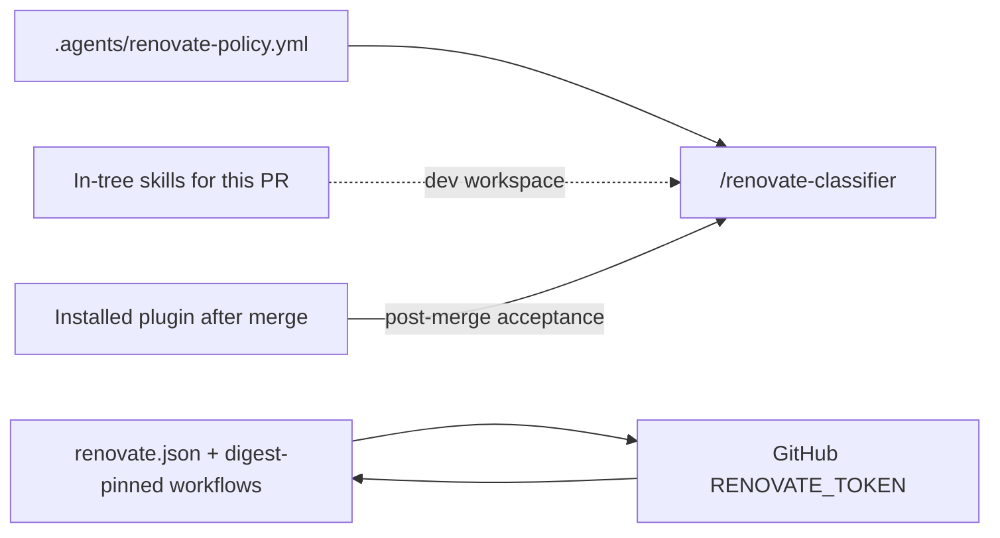

# Shipped

Dogfood Renovate setup plan completed 2026-08-31.

| Slice | Outcome |
| --- | --- |
| **dogfood-setup** | Consumer policy, bot config, digest-pinned workflows, gitignore, and first-party freshness-poll script. Merged as [multipliers-dev/renovate-workflow#11](https://github.com/multipliers-dev/renovate-workflow/pull/11) at `64a6d6805449e6bf95bff4cf377bbc30b55f9381`. |
| **plan-closure** | Docs-only archive (this PR). |

**What actually shipped:**

- **[`.agents/renovate-policy.yml`](../../.agents/renovate-policy.yml)** — consumer facts for `multipliers-dev/renovate-workflow`; `tsx` on `packages.high_touch` (interpreter for first-party ladder CLIs); CI checks bound to `.github/workflows/ci.yml` job `test`; `deployment.mode: pat_branch`.
- **[`renovate.json`](../../renovate.json)** — `config:recommended`, `branchPrefix: renovate/`, Sydney timezone, `lockFileMaintenance` Monday morning, GitHub Actions **`pinDigests: true`**, npm groups aligned with policy buckets.
- **Workflows** — digest-pinned `uses:` (`owner/action@<sha> # vX.Y.Z`) in [`.github/workflows/ci.yml`](../../.github/workflows/ci.yml), [`.github/workflows/renovate.yml`](../../.github/workflows/renovate.yml), and [`.github/workflows/validate-renovate-config.yml`](../../.github/workflows/validate-renovate-config.yml); self-hosted Renovate with `RENOVATE_TOKEN`, `workflow_dispatch`, and weekly cron.
- **[`.gitignore`](../../.gitignore)** — `.agent-runs/renovate/`.
- **[`package.json`](../../package.json)** — `"renovate:freshness-poll": "tsx scripts/renovate-freshness-poll.ts"`; **no** `renovate-workflow` git self-dependency.

**Follow-up fixes on #11 before merge:**

- **`renovate.json`** — `@types/*` grouping uses `matchPackageNames: ["/^@types/"]` instead of `matchPackagePatterns`; `renovate-config-validator --strict` rejects the patterns form.
- **`.github/workflows/renovate.yml` cron** — `0 18 * * 0` (Sunday 18:00 UTC) instead of `0 19 * * 0`; the earlier schedule was Monday 06:00 AEDT, outside the `lockFileMaintenance` window (`before 6am on Monday` in Australia/Sydney).

**Deferred (out of scope for dogfood-setup and plan-closure):**

- GitHub secret `RENOVATE_TOKEN` on `multipliers-dev/renovate-workflow`
- First manual **Actions → Renovate → workflow_dispatch** run (blocked on secret)
- Post-merge **installed-plugin** classifier acceptance — in-tree `.cursor/skills/` is sufficient for development but is not the distribution-path check; run `/renovate-classifier` once from a workspace where the plugin resolves through marketplace install

# Dogfood Renovate on renovate-workflow

Plan-only PR lands this file. Implementation is a later slice. Do not begin `dogfood-setup` in the plan-only PR.

This repo is already the plugin source. The README’s remaining consumer work is the local facts + Renovate bot — not another plugin copy and **not** `github:multipliers-dev/renovate-workflow` as a git dependency of itself.



## Recommended execution authority

| Slice | Recommended authority | Agent instruction |
| --- | --- | --- |
| This commit (plan artifact) | Plan-only PR | Do not implement. Stop after opening the plan-only PR. |
| dogfood-setup | Open PR only | Do not merge. Stop after opening the PR. |
| plan-closure | Open PR only | Do not merge. Stop after opening the PR. |

Repo default: **Open PR only**.

**Rationale (Plan-only PR):** alias request to commit the plan only and open a PR for review before any dogfood-setup edits.

**Rationale (dogfood-setup):** one coherent consumer-setup PR; default authority is Open PR only.

**Rationale (plan-closure):** docs-only archive after the implementation PR merges.

## Repository topology (default)

The repository integration branch is `main`. Each slice starts from and targets `main`.

**Before implementation:** `git fetch` then a fresh branch from `origin/main`.

**Before opening the PR:** the branch represents only this slice.

**After opening the PR:** GitHub PR base branch is `main`.

Do not infer topology from the current workspace multi-root, a prior extract-plan branch, or Codenames.

---

## Follow the README, adapted for dogfood

From [README.md](../../README.md) / [docs/adopt.md](../../docs/adopt.md):

| Adopt step | This repo |
| --- | --- |
| Import marketplace + install plugin | Human Cursor UI. In-tree `.cursor/skills/` is enough to develop the implementation slice; it is **not** the consumer distribution path (see post-merge acceptance). |
| Copy template → `.agents/renovate-policy.yml` | **In dogfood-setup** — customize for this tree |
| `renovate.json` + `.github/workflows/renovate.yml` | **In dogfood-setup** — `pat_branch` + digest-pinned `uses:` |
| Gitignore `.agent-runs/renovate/` | **In dogfood-setup** |
| npm git `devDependency` for babysit helpers | **Skip** — circular. Scripts already first-party; add a local npm script alias instead |

**Packaging topology (intentional, not a workflow-semantics fork):**

- Normal consumer: plugin + consumer policy + git helper dependency
- This repo: in-tree source + consumer policy + first-party helper script

Deployment mode: **`pat_branch`** — self-hosted Actions + `RENOVATE_TOKEN` + `renovate/` prefix. Use the same `RENOVATE_TOKEN` credential model as Codenames; a classic `repo` PAT is the current Codenames deployment, not a permanent dogfood contract. That is the org’s live bot transport, not a source of package-list or action-pin inheritance.

---

## Slice dogfood-setup — consumer files for this repo

**Recommended authority:** Open PR only

**Rationale:** One merge-safe consumer setup: policy facts, bot config, digest-pinned workflows, gitignore, first-party helper script.

**Agent instruction:** Do not merge. Stop after opening the PR.

### 1. Consumer policy — [`.agents/renovate-policy.yml`](../../.agents/renovate-policy.yml) (new)

Copy [`.agents/renovate-policy.template.yml`](../../.agents/renovate-policy.template.yml). Keep `version: "3"` and the portable risk/authority/check_assembly blocks. Customize only facts:

- **`repo`:** `owner: multipliers-dev`, `name: renovate-workflow`, `renovate_branch_prefix: renovate/`, `workspace_roots: [package.json]`
- **`sensitive_paths`:** `scripts/**`, `.agents/**`, `.cursor/skills/**`, `.github/workflows/**`, `renovate.json`
- **`analytics_paths` / `auth_paths`:** empty (`[]`)
- **`packages.high_touch`:** `typescript`, `vitest`, `yaml`, **`tsx`**
- **`packages.low_risk_tooling`:** `husky`, `@types/*`
- **`tsx` rationale (this repo, not inherited):** `tsx` is the interpreter for first-party ladder CLIs (`scripts/renovate-freshness-poll.ts` and the `renovate:freshness-poll` script). A `tsx` upgrade can break babysit/freshness-poll even when the only diffs are `package.json` / lockfile. That is product-surface risk, so it belongs on the high-touch / investigation path — not low-risk auto-merge, and not “unlisted because Codenames left it unlisted.”
- **`checks`:** bind `pr_ci_green` / `post_merge_main_ci_green` to existing [`.github/workflows/ci.yml`](../../.github/workflows/ci.yml) job `test`
- **`deployment.mode`:** `pat_branch`

Do not move or rewrite [examples/example-repo/renovate-policy.yml](../../examples/example-repo/renovate-policy.yml) — tests hardcode that path.

### 2. Bot config — [`renovate.json`](../../renovate.json) (new)

Start from the example stub, then tighten for this small single-package repo:

- `extends: ["config:recommended"]`, `branchPrefix: "renovate/"`, `timezone: "Australia/Sydney"`
- `dependencyDashboard: true`, modest `prHourlyLimit` / `prConcurrentLimit`
- `lockFileMaintenance` Monday morning Sydney
- Group npm patch/minor; group GitHub Actions
- `packageRules` for `github-actions`: **`pinDigests: true`** (required — this is the convention `workflow_uses_pin_only` / action-pin classification expects)
- Optional small groups for typescript/vitest/`tsx`/`yaml` vs husky/`@types` — keep groups aligned with **this** policy’s buckets

### 3. Workflow `uses:` convention — digest-pinned, deterministic

No unpinned major tags (`@v4`, `@v7`) and no “match existing CI unless the other pin is cleaner.” Resolve current stable tags **and their commit SHAs** at implementation time; write every `uses:` as:

```yaml
uses: owner/action@<commit-sha> # vX.Y.Z
```

Apply that to **all** workflow `uses:` this slice touches:

- New [`.github/workflows/renovate.yml`](../../.github/workflows/renovate.yml)
- New [`.github/workflows/validate-renovate-config.yml`](../../.github/workflows/validate-renovate-config.yml)
- Existing [`.github/workflows/ci.yml`](../../.github/workflows/ci.yml) (`actions/checkout`, `actions/setup-node`) — pin in this same PR so the repo starts from the desired dogfood state instead of leaving incidental unpinned majors for the first Renovate run to invent

Expected pins (resolve SHAs at implement time; do not copy another repo’s tags as authority):

- `actions/checkout`
- `actions/setup-node`
- `renovatebot/github-action`

Node **runtime** for CI/validate stays **22** (this repo’s current CI), independent of action major/digest. That is a runtime fact, not an action-pin inheritance.

### 4. Self-hosted Renovate workflow — [`.github/workflows/renovate.yml`](../../.github/workflows/renovate.yml) (new)

Do **not** leave the example placeholder `echo`. Enable `pat_branch`:

- `workflow_dispatch` + weekly cron (Sydney-friendly, e.g. `0 19 * * 0`)
- `permissions: contents: read`
- Digest-pinned `renovatebot/github-action` with `token: ${{ secrets.RENOVATE_TOKEN }}`
- `RENOVATE_REPOSITORIES: ${{ github.repository }}`, `RENOVATE_ONBOARDING: false`

### 5. Config validator — [`.github/workflows/validate-renovate-config.yml`](../../.github/workflows/validate-renovate-config.yml) (new)

Policy `check_assembly` already requires this when `renovate.json` changes. Path-filtered workflow running `npx -p renovate -c 'renovate-config-validator --strict'`. Digest-pin checkout/setup-node; Node 22 as above.

### 6. Gitignore + first-party helper script

- Add `.agent-runs/renovate/` to [`.gitignore`](../../.gitignore)
- Add `"renovate:freshness-poll": "tsx scripts/renovate-freshness-poll.ts"` to [package.json](../../package.json) so adopt’s verification command works without a self-git-dep
- Do **not** add `renovate-workflow` to `devDependencies`

### Out of this slice (human)

1. **GitHub secret** `RENOVATE_TOKEN` — use the same credential model as Codenames on `multipliers-dev/renovate-workflow`. Do not create the secret in this PR. Do not run the Renovate workflow until it exists. A classic `repo` PAT is what Codenames uses today; it is not part of this repo’s dogfood contract.
2. After merge + secret: **Actions → Renovate → workflow_dispatch**, then classify (success is `queue_empty` or a packet). Classifier never merges.

### Post-merge acceptance — installed-plugin boundary

In-tree `.cursor/skills/` lets this workspace develop and may make `/renovate-classifier` succeed for the wrong reason. That does **not** block `dogfood-setup` (self-hosting the plugin source makes the boundary awkward). After merge, deliberately run **one** classifier acceptance from a context where `/renovate-classifier` resolves through the **installed plugin** (marketplace import → install), not by assuming the in-tree skill. That is the strongest end-to-end check of the public distribution path; policy + bot files in this slice do not substitute for it.

### Acceptance

- `.agents/renovate-policy.yml` exists; `tsx` is `high_touch` with this-repo rationale; template and `examples/example-repo/renovate-policy.yml` unchanged
- `renovate.json` has `pinDigests: true` for GitHub Actions
- New workflows plus existing `ci.yml` use `owner/action@<sha> # vX.Y.Z` (no unpinned majors)
- `.agent-runs/renovate/` is gitignored
- `npm run renovate:freshness-poll -- --help` prints usage
- `npm test` and `npm run typecheck` green
- No `renovate-workflow` git self-dependency
- Do not run the Renovate Action from the agent (needs the secret)

### Explicitly out of scope

- Circular `github:multipliers-dev/renovate-workflow` dependency
- Vendoring extra copies of skills/agents/runbook
- Changing portable rubric, packet schema, or example-repo fixtures
- Creating the GitHub secret, running the Renovate workflow, or merging the PR
- Solving the in-tree vs installed-plugin resolution problem inside this slice

---

## Plan closure (docs-only PR)

**Recommended authority:** Open PR only

**Rationale:** Docs-only archival after the implementation PR merges.

**Agent instruction:** Do not merge. Stop after opening the PR.

After `dogfood-setup` merges:

1. Verify the implementation PR is actually merged to `main`
2. Verify remaining todos are `completed` or `cancelled`
3. Add `# Shipped` with date, PR links, deferred work (including post-merge plugin-boundary acceptance)
4. Move to `.cursor/plans/archive/2026-08-31-dogfood-renovate-setup.plan.md`
5. Mark `plan-closure` completed; update references

---

## Agent prompts (copy/paste for Cursor)

Use a **fresh Agent-mode chat** per slice. Each default frontmatter todo has exactly one `### <todo-id>` heading copied from that todo’s `id`.

### dogfood-setup

```text
@.cursor/plans/archive/2026-08-31-dogfood-renovate-setup.plan.md

Implement slice dogfood-setup only. Do not start plan-closure. Do not archive the plan.

Authority: Open PR only — implement and open the PR; do not merge.

Topology: start from latest origin/main; branch represents only this slice; PR base must be main.

Deliverables: add .agents/renovate-policy.yml (tsx high_touch with this-repo rationale); add renovate.json with github-actions pinDigests; add digest-pinned renovate.yml and validate-renovate-config.yml; digest-pin existing ci.yml uses; gitignore .agent-runs/renovate/; add first-party renovate:freshness-poll script. Do not add a self git dependency. Do not create RENOVATE_TOKEN or run the Renovate workflow. Mark dogfood-setup completed in plan frontmatter in this PR.

Verification: npm test and npm run typecheck; npm run renovate:freshness-poll -- --help; every workflow uses: is owner/action@sha with version comment; template and examples/example-repo/renovate-policy.yml unchanged.
```

### plan-closure

```text
@.cursor/plans/archive/2026-08-31-dogfood-renovate-setup.plan.md

Execute only plan-closure.

Authority: Open PR only — docs-only archive PR; do not merge.

Prerequisites: implementation PRs actually merged to main (not merely frontmatter completed).

Topology: start from latest origin/main; branch represents only this slice; PR base must be main.

Deliverables: verify slice todos, add # Shipped note, move plan to .cursor/plans/archive/2026-08-31-dogfood-renovate-setup.plan.md, mark plan-closure completed, update agent prompt references to the archived path.

Verification: confirm the dogfood-setup PR is merged and slice todos are completed before archiving.
```
