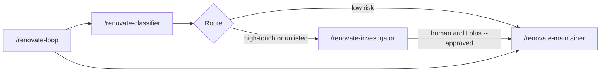

# Shipped

Public-consumption polish plan completed 2026-08-31.

| Slice | Outcome |
| --- | --- |
| **public-readiness** | External-adopter README and docs, MIT license, security reporting, issue templates, expanded `examples/example-repo/`, and versioning notes. Merged as [multipliers-dev/renovate-workflow#8](https://github.com/multipliers-dev/renovate-workflow/pull/8) at `c67079f69045799458f515c014d9bb6d880f967e`. |
| **plan-closure** | Docs-only archive (this PR). |

**What actually shipped (corrections vs plan text):**

- **README** — product-value lead, classifier-only Quick start, separate loop/babysit helpers section, primary doc path, no History section (extraction history not moved to README footer).
- **Adoption docs** — [docs/adopt.md](../../docs/adopt.md), [docs/policy-setup.md](../../docs/policy-setup.md), [docs/renovate-workflow.md](../../docs/renovate-workflow.md), [docs/distribution-discovery.md](../../docs/distribution-discovery.md), [AGENTS.md](../../AGENTS.md) de-internalized; classifier path first; npm/git helper optional for loop/babysit only. Policy template copy in adopt.md is from the plugin path in Quick start; `node_modules/` copy is documented only as an optional alternative when enabling helpers — not a node_modules-first policy workflow.
- **Public contract** — consumption + feedback (use, inspect, fork, report issues). **No** community contribution model: `CONTRIBUTING.md` and `.github/pull_request_template.md` were **removed before merge** and were not re-added.
- **LICENSE** — MIT; copyright `Copyright (c) 2026 Michael Truong` (aligned with cursor-team-marketplace), not multipliers-dev.
- **SECURITY.md** — private reporting via GitHub Security Advisories only; no SLA or acknowledgement-before-disclosure language.
- **Issue templates** — `.github/ISSUE_TEMPLATE/bug_report.md` and `documentation.md`.
- **Example consumer** — [examples/example-repo/](../../examples/example-repo/) README, `renovate.json`, workflow stub, policy YAML comments; synthetic `example-org/example-service` policy unchanged (tests depend on path).
- **Versioning** — [docs/versioning.md](../../docs/versioning.md); `package.json` `"license": "MIT"` plus `repository` / `bugs` / `homepage`; no tag or GitHub release published.

**npm/git helper scope:** required for `/renovate-loop --babysit` and the freshness poll CLI — **not** for classifier-only evaluation or plain `/renovate-loop`.

**Deferred (out of scope):**

- GitHub About description / topics / social preview (suggested in PR body only; not mutated in-repo)
- npm publish, GitHub release, or tags
- `CODE_OF_CONDUCT.md`
- New ladder capabilities, packet fields, or policy semantics

# Public-consumption polish for renovate-workflow

Plan-only PR lands this file. Implementation is a later slice. Do not begin `public-readiness` in the plan-only PR.

## Recommended execution authority

| Slice | Recommended authority | Agent instruction |
| --- | --- | --- |
| This commit (plan artifact) | Plan-only PR | Do not implement. Stop after opening the plan-only PR. |
| public-readiness | Open PR only | Do not merge. Stop after opening the PR. |
| plan-closure | Open PR only | Do not merge. Stop after opening the PR. |

Repo default: **Open PR only**.

**Rationale (Plan-only PR):** alias request to commit the plan only and open a PR for review before any public-readiness edits.

**Rationale (public-readiness):** one coherent docs/hygiene PR; default authority is Open PR only.

**Rationale (plan-closure):** docs-only archive after the implementation PR merges.

## Repository topology (default)

The repository integration branch is `main`. Each slice starts from and targets `main`.

**Before implementation:** `git fetch` then a fresh branch from `origin/main`.

**Before opening the PR:** the branch represents only this slice.

**After opening the PR:** GitHub PR base branch is `main`.

Do not infer topology from the current workspace multi-root, a prior extract-plan branch, or Codenames.

---

## Audit verdict (first-time external user)

Shipped product lives on GitHub `main` at `9f17dc9c1768c95ce275ec20ab24a7972448e46d` (also the installed Cursor plugin cache). Extraction, marketplace wrapper, Codenames consumer migration, and plan closure have already merged (`#2`, `#3`, `#5`, `#6`).

**What it is:** a Cursor plugin plus portable decision logic that classifies one Renovate PR at a time, investigates high-risk cases, and may merge only when policy and human gates allow.

**Who it is for:** teams that already run Renovate and want a governed, human-in-the-loop merge ladder inside Cursor.

**Problem it solves:** Renovate opens many dependency PRs; this product turns that queue into a repeatable classify → route → (investigate) → maintainer path with repo-local policy, instead of ad-hoc merges.

**Cursor-specific vs portable:**

- Cursor-only: `.cursor-plugin/*`, `/renovate-*` skills, agent prompts
- Portable: policy schema, `policy-rubric.base.md`, packet/guardrail TypeScript, freshness-poll CLI
- Consumer-owned: `.agents/renovate-policy.yml`, `renovate.json`, Renovate workflow YAML

**Gaps that make the repo look unfinished:**

- [README.md](../../README.md) leads with “extracted from Codenames” and ends with PR1/PR2/PR3 history
- [docs/adopt.md](../../docs/adopt.md), [docs/policy-setup.md](../../docs/policy-setup.md), and [docs/distribution-discovery.md](../../docs/distribution-discovery.md) still speak in extraction-plan language (`PR1`, `PR2+`, `Phase A`, “Codenames PR3”, `cursor-team-marketplace`)
- [docs/renovate-workflow.md](../../docs/renovate-workflow.md) uses internal “Phase 6” and example PR `412`
- No `LICENSE`, `CONTRIBUTING.md`, `SECURITY.md`, issue/PR templates
- [examples/example-repo/](../../examples/example-repo/) is only a policy YAML (schema-valid, synthetic `example-org/example-service` — good) with no Renovate/config stubs or adopter comments
- `package.json` / `.cursor-plugin/plugin.json` are `0.1.0`; marketplace manifest has no version; **no tags or GitHub releases**
- GitHub About/description/topics are empty (in-repo cannot set these)
- Local workspace `/Users/michaeltruong/code/renovate-workflow` may still be a **pre-extraction stub**. Implementation must start from GitHub `origin/main` of `multipliers-dev/renovate-workflow`.

**License:** MIT. Add `LICENSE` and `"license": "MIT"` in `package.json`.

**Skip:** `CODE_OF_CONDUCT.md` (boilerplate, not needed for this size of contributor surface).



---

## Slice — public-readiness

**Recommended authority:** Open PR only

**Rationale:** One coherent public-readiness concern. Do not add ladder capabilities or redesign the workflow.

**Agent instruction:** Do not merge. Stop after opening the PR.

**Goal:** After merge, a first-time external user can understand the product, adopt it via the two-step Cursor flow, run a read-only classifier smoke test without touching `package.json`, and find contribution / license / security docs.

### Execution preflight

- Required repository: `multipliers-dev/renovate-workflow` (write target).
- Confirm the checkout remote is that repo, then `git fetch` and branch from latest `origin/main`. If the local folder is still the greenfield stub, reset/reclone or use a worktree from `origin/main` before editing.
- Do not infer topology from the current workspace multi-root or from Codenames.

### README rewrite

Replace [README.md](../../README.md) for an external adopter:

- Lead with product value (governed Renovate merges with human gates), not extraction history
- Short workflow sequence: classify → investigate when needed → maintainer → optional loop
- Ownership split: portable logic here; consumer facts/config in the adopting repo; executables via git/npm dependency
- Copy/pasteable two-step Cursor install (import this GitHub repo as a local marketplace, then install `renovate-workflow` from that marketplace)
- **Quick start** — optimize for time-to-first-value. Minimum read-only classifier path only (no `package.json` change):
  1. Import marketplace
  2. Install plugin
  3. Confirm `/renovate-classifier` exists
  4. Copy/customize `.agents/renovate-policy.yml`
  5. Ensure GitHub access (`gh` or GitHub MCP)
  6. Run `/renovate-classifier`
  - Success is `queue_empty` or a classification packet. Classifier never merges.
- Immediately after Quick start, add **Enable loop/babysit helpers**: npm/git dependency + `renovate:freshness-poll`. Required for executable helpers such as `/renovate-loop --babysit`. Not required to evaluate the classifier.
- **What this does not do:** not fully autonomous merging; no scheduled/webhook automation; classifier/investigator never merge; loop never passes `--approved`; not the Renovate bot itself; not Cursor’s public marketplace or a Team Marketplace catalog
- Move Codenames/extraction history to a short “History” note at the bottom (optional link to archived plan)
- Keep install commands current; primary doc path is README → adopt → policy-setup → runbook. Link `distribution-discovery.md` only as architecture rationale / deep-dive, not in the primary adopter path.

### Adoption docs (external-user pass)

Edit in place; do not invent new distribution:

- [docs/adopt.md](../../docs/adopt.md) — drop “no dependency on Codenames”, “Phase A evidence”, “Codenames PR3 deletes…”. Keep the validated two-step import → install flow and the three-layer table (plugin / npm helpers / consumer config). Replace `/renovate-classifier 412` with a generic `{N}`. Keep the “this is not a Team Marketplace / not the public marketplace” distinction without requiring knowledge of `cursor-team-marketplace`. Align with the same Quick start split: classifier path first, npm/git helpers as a later step for loop/babysit.
- [docs/policy-setup.md](../../docs/policy-setup.md) — remove `PR1` / `PR2+` / “Codenames parity is PR3”. Present the sync model as current: one consumer YAML, portable rubric interprets it, `unlisted` is derived.
- [docs/renovate-workflow.md](../../docs/renovate-workflow.md) — replace “Phase 6” with plain “scheduled automation is out of scope”; replace PR `412` with `{N}`; keep the mermaid and operator detail (this is the runbook, not a rewrite).
- [docs/distribution-discovery.md](../../docs/distribution-discovery.md) — keep the file. Clearly label it as **architecture rationale / maintainer deep-dive**, not primary user documentation. Drop `PR2 Phase A` framing. Keep the plugin vs npm vs consumer-local distinction. A new adopter should follow README → adopt → policy-setup → runbook.
- [AGENTS.md](../../AGENTS.md) — drop “extracted from Codenames” and leftover “No distribution tooling in PR1 scope”. Keep command table + pointers.

Do not teach install-from-`cursor-team-marketplace`. Do not make public docs depend on archived plan knowledge.

### Public hygiene (add only what is missing)

- `CONTRIBUTING.md` — repo-specific: `npm install`, `npm test`, `npm run typecheck`; portable logic belongs in skills/agents/scripts/`policy-rubric.base.md`; consumer facts must not be added here; policy-semantics changes need schema + example + fixtures; classifier/packet changes need fixtures under `scripts/fixtures/`; plugin/marketplace manifest notes (`.cursor-plugin/plugin.json` version stays aligned with `package.json`; marketplace is the GitHub-import catalog)
- `SECURITY.md` — report privately via GitHub Security Advisories; do not file public issues for unfixed merge-authority / credential issues
- `.github/pull_request_template.md` — short: summary, test plan, note if policy/packet/plugin manifests changed
- `.github/ISSUE_TEMPLATE/` — one bug + one docs template only if they stay one screen; otherwise a single `ISSUE_TEMPLATE.md`
- `LICENSE` + `package.json` `"license": "MIT"`
- Skip Code of Conduct

Leave leftover `src/index.ts` (“ready”) and `npm run dev` alone unless CONTRIBUTING would confuse people; if mentioned, say product logic lives in `scripts/` and plugin assets.

### Example consumer

Keep [examples/example-repo/renovate-policy.yml](../../examples/example-repo/renovate-policy.yml) as the schema-backed synthetic example (`version: "3"`, `example-org/example-service`). Four tests hardcode this path — **do not move the file** unless those test paths are updated in the same PR.

Add:

- `examples/example-repo/README.md` — this is a template, not a snapshot; copy policy to consumer `.agents/renovate-policy.yml`
- Representative `renovate.json` stub (recommended config + `branchPrefix`, not Codenames package groups / Sydney timezone)
- Representative `.github/workflows/renovate.yml` stub with comments for `pat_branch` (self-hosted + token) vs `github_app` (hosted app; workflow may be unused)
- Comments on the policy YAML for what an adopter must customize: `packages.*`, `checks.*` workflow/job names, `repo.workspace_roots` / path lists, `deployment.mode`, `renovate_branch_prefix`

Keep [examples/adopt-stub/package.json](../../examples/adopt-stub/package.json) as the npm snippet.

### Versioning readiness (document, do not publish)

Recommend in README (short) or `docs/versioning.md`:

- Align `package.json` version and `.cursor-plugin/plugin.json` `version` (already both `0.1.0`)
- Marketplace catalog (`.cursor-plugin/marketplace.json`) has no version field; treat it as install metadata, not a release artifact
- Consumers install helpers as `github:multipliers-dev/renovate-workflow` today (tracks `main`). After a human cuts `v0.1.0`, prefer `github:multipliers-dev/renovate-workflow#v0.1.0`
- Keep `"private": true` (git dependency, not npm registry)
- Add `repository` / `bugs` / `homepage` to `package.json` so the git package is identifiable

Do **not** `npm publish`, do **not** `gh release create`, do **not** push tags unless later asked.

### Repository metadata (report in PR body only)

Do not mutate GitHub settings.

Suggested:

- Description: `Governed Renovate merge ladder for Cursor: classify, investigate, and merge dependency PRs with repo-local policy and human gates.`
- Topics: `renovate`, `cursor`, `cursor-plugin`, `dependencies`, `github-actions`
- Social preview: optional; skip unless a graphic already exists

### Verification

- `npm test` and `npm run typecheck` (existing CI in [`.github/workflows/ci.yml`](../../.github/workflows/ci.yml))
- Docs consistency: install commands match the two-step flow; relative links resolve; no public doc tells people to install from `cursor-team-marketplace`; no normative doc requires archived-plan knowledge; example policy still matches `version: "3"` / current template schema
- PR body includes execution authority, shipped scope, verification, suggested GitHub settings, versioning recommendation, and license status

### Out of scope

- New ladder skills, packet fields, or policy semantics
- npm publish / GitHub release / tags
- Changing GitHub repo settings
- Code of Conduct
- Codenames or marketplace-repo follow-up PRs

**Acceptance:**

- README Quick start is the minimum classifier path (no npm/git dep required)
- Loop/babysit helpers documented as a subsequent step
- Primary adopter path is README → adopt → policy-setup → runbook
- `distribution-discovery.md` labeled as architecture rationale
- MIT LICENSE and `package.json` `"license": "MIT"`
- Example consumer is usable without being a Codenames snapshot
- `npm test` and `npm run typecheck` green

---

## Plan closure (docs-only PR)

**Recommended authority:** Open PR only

**Rationale:** Docs-only archival after the implementation PR merges.

**Agent instruction:** Do not merge. Stop after opening the PR.

After `public-readiness` merges:

1. Verify the implementation PR is actually merged to `main`
2. Verify remaining todos are `completed` or `cancelled`
3. Add `# Shipped` with date, PR links, deferred work
4. Move to `.cursor/plans/archive/2026-08-31-public-consumption-polish.plan.md`
5. Mark `plan-closure` completed; update references

---

## Agent prompts (copy/paste for Cursor)

Use a **fresh Agent-mode chat** per slice.

### public-readiness

```text
@.cursor/plans/archive/2026-08-31-public-consumption-polish.plan.md

Implement slice public-readiness only. Do not start plan-closure. Do not archive the plan.

Authority: Open PR only — implement and open the PR; do not merge.

Topology: start from latest origin/main; branch represents only this slice; PR base must be main.

Deliverables: rewrite README with minimum classifier Quick start then loop/babysit helpers; de-internalize adopt/policy/runbook/AGENTS; label distribution-discovery as architecture rationale; add MIT LICENSE, CONTRIBUTING, SECURITY, PR/issue templates; expand examples/example-repo; document versioning without publishing. Mark public-readiness completed in plan frontmatter in this PR.

Verification: npm test and npm run typecheck; docs link/consistency audit; no cursor-team-marketplace install path; example policy still version 3.
```

### plan-closure

```text
@.cursor/plans/archive/2026-08-31-public-consumption-polish.plan.md

Execute only plan-closure.

Authority: Open PR only — docs-only archive PR; do not merge.

Prerequisites: implementation PRs actually merged to main (not merely frontmatter completed).

Topology: start from latest origin/main; branch represents only this slice; PR base must be main.

Deliverables: verify slice todos, add # Shipped note, move plan to .cursor/plans/archive/2026-08-31-public-consumption-polish.plan.md, mark plan-closure completed, update agent prompt references to the archived path.

Verification: confirm the public-readiness PR is merged and slice todos are completed before archiving.
```
