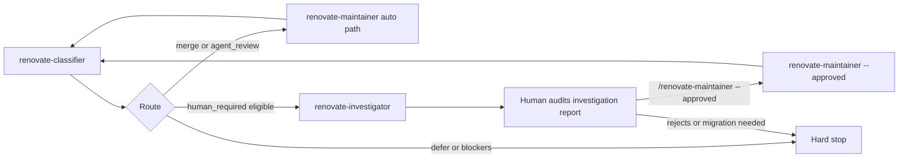

# Renovate PR workflow (manual)

Open Renovate dependency PRs are handled through a **manual four-step ladder**: classify **one** Renovate PR per `/renovate-classifier` run (FIFO over the **active** non-draft queue), investigate when the packet is investigation-eligible (`high_touch_tooling` or `unlisted_package` with only overridable classifier stops; investigation-approved execution remains restricted to dependency-only allowed paths), human-audit the investigation report and run `/renovate-maintainer --approved` when ready, then re-run classify for the next item. Low-risk packets skip investigation and go straight to the maintainer auto path. **Draft Renovate PRs are skipped** by the classifier (and therefore by `/renovate-loop`) until marked ready for review.

**Portable implementation:** this repository owns the ladder (skills, agents, scripts, runbook). Consumer repositories retain `renovate.json`, `.github/workflows/renovate.yml`, and `.agents/renovate-policy.yml`. See [policy-setup.md](policy-setup.md).

**Deployment modes** (configured in consumer `.agents/renovate-policy.yml` → `repo.renovate_branch_prefix` and workflow):

| Mode | Typical setup |
| --- | --- |
| `pat_branch` | Self-hosted Renovate via GitHub Actions + PAT; PRs use `renovate/` branch prefix; authored by PAT owner, not `app/renovate` |
| `github_app` | Hosted Renovate / GitHub App; author is typically `app/renovate`; head branch may differ |

Scheduled runs, webhooks, and other automation are **out of scope** for this product — use the manual path below.

---

## Overview



**Classifier** ([`renovate-classifier`](../.cursor/skills/renovate-classifier/SKILL.md)) discovers open Renovate PRs, builds an **active** (non-draft) queue, and analyzes **one** PR per run (FIFO lowest active number, or explicit PR number in the active set). Draft Renovate PRs are reported in discovery reconciliation but are not selectable. Before expensive analysis it checks base-branch freshness and runs `gh pr update-branch` when the PR is `BEHIND`. It emits one recommendation plus one YAML **execution packet** with structured `stop_causes` when `stop: true`. It never merges, approves, comments, or closes PRs (except the bounded `gh pr update-branch` write when `BEHIND`).

**Investigator** ([`renovate-investigator`](../.cursor/skills/renovate-investigator/SKILL.md) / [`.agents/renovate-investigator.md`](../.agents/renovate-investigator.md)) gathers four-step evidence for investigation-eligible packets (`high_touch_tooling` or `unlisted_package`, `stop: true`, overridable `stop_causes` only). It writes a gitignored investigation report and may emit a declarative execution overlay when verdict is `ready_for_human_merge`. Investigation-approved execution remains restricted to dependency-only `allowed_paths`. It has **no merge authority** and never passes `--approved`.

**Maintainer agent** ([`.agents/renovate-maintainer.md`](../.agents/renovate-maintainer.md)) consumes one packet on the **auto path** (`stop: false`) and may merge when policy and CI allow. On the **investigation-approved path**, invoke with **`--approved`** plus the investigator overlay after human audit — packet `merge_authority: denied` stays immutable; effective authority is derived at execute time.

---

## Prerequisites

1. **GitHub MCP or authenticated `gh` CLI (operator credential)** — required when classifying or executing Renovate PRs. This is your Cursor MCP token or `gh auth`, not the Renovate bot Actions secret.
   - **MCP (preferred in packet workflow):** read-only endpoint for classifier (`https://api.githubcopilot.com/mcp/readonly`); maintainer needs merge tools (write access).
   - **`gh` fallback:** read-only for most classifier steps; classifier also needs **write** access for `gh pr update-branch` when a PR is `BEHIND`; maintainer may use `gh pr merge --merge` when all gates pass (see merge authority guard below). This repo allows **merge commits only** — never `--squash` or `--rebase`.
2. **Classic `repo` PAT (operator MCP / `gh`)** — use for Checks API (`get_check_runs` / `gh pr checks`) on this path; fine-grained PATs used here returned `403` for `get_check_runs`. Configure in `~/.cursor/mcp.json` or via authenticated `gh`; this is separate from `secrets.RENOVATE_TOKEN`.
3. **Renovate bot token (`pat_branch`)** — a separate GitHub Actions secret `RENOVATE_TOKEN` for self-hosted Renovate. A fine-grained PAT with Contents, Pull requests, Issues, Actions, and Workflows write (org repos as needed) is sufficient; classic `repo` scope is optional for the bot.
4. **Cursor Agent mode** for the maintainer step (fresh chat per PR).

After updating MCP tokens or `gh` auth, fully quit and restart Cursor if needed.

**Merge authority guard:** `gh pr merge` is allowed only when the plan or runbook already grants merge authority (Renovate maintainer agent invoked with a valid packet and all pre-merge gates satisfied). This change does **not** expand merge authority — it is a transport fallback for the same gated merge step, not a new permission to merge from generic agent sessions or Open PR only slices.

---

## Workflow

Work **one PR per classify run**. Route by packet shape after classification. Repeat until the **active (non-draft)** queue is clear (`queue_empty`) or only deferred/manual items remain. Parked drafts may still be open — that is a human backlog, not “done.”

### Parked drafts (operator lifecycle)

Use draft state to park a Renovate PR that should not enter the ladder yet (for example, an ecosystem-wide major upgrade blocked on upstream compatibility).

- **Park** — Convert the PR to draft, document why it is parked, and record the unblock criteria (reason and unblock condition may differ). Prefer draft over closing when the intent is “resume later,” because closing may suppress future Renovate attempts depending on repository configuration.
- **Loop / classifier** — Drafts are reported in discovery reconciliation but are not selectable. `/renovate-loop` and FIFO skip them until **Ready for review**. Drafts-only ⇒ `queue_empty` (active queue clear), not “no migration work left.” Draft FIFO for readiness triage lives in `/renovate-draft-readiness` (below); the active classify/loop queue is unchanged.
- **Draft readiness** — Run `/renovate-draft-readiness` (or `/renovate-draft-readiness <PR>` for an explicit draft) to assess one parked draft Renovate PR and **always refresh** its managed GitHub readiness comment (`<!-- renovate-draft-readiness -->`). Orthogonal to the merge ladder: it does **not** unpark, merge, approve, close, or update/rebase the branch, and it does **not** emit classifier packets or feed maintainer/investigator. There is no dry-run mode — comment publication is the skill. Skill: [`renovate-draft-readiness`](../.cursor/skills/renovate-draft-readiness/SKILL.md).
- **Unpark** — Mark **Ready for review** (human). The PR immediately re-enters the active queue. It can then be processed normally via `/renovate-loop` (FIFO) or selected explicitly with `/renovate-classifier <PR>`. Expect the normal route for that PR’s risk class (often investigation / hard stop for high-touch majors) — not the auto-merge path by default. Eligibility is controlled by draft state, not operator memory. A `ready_to_unpark` verdict from draft-readiness is a recommendation only.
- Do **not** ask the ladder to analyze or merge while the PR is draft.

### 1. Classify (one PR)

Run `/renovate-classifier` for the next FIFO Renovate PR, or `/renovate-classifier {N}` for a specific PR in the active (non-draft) Renovate set.

You get:

- **Discovery reconciliation** — active (non-draft) Renovate queue plus draft skips
- **Queue overview** — which PR was selected and what remains
- **Base freshness** block (and branch update if the PR was `BEHIND`)
- A **one-row summary table**
- **Detailed notes** for the selected PR only
- **One execution packet** (YAML) with `stop_causes` when `stop: true`
- A **handoff prompt** — maintainer (auto path), investigator (investigation lane), or none (hard stop)

### 2. Route

| Packet                                   | Next step                                                                 |
| ---------------------------------------- | ------------------------------------------------------------------------- |
| `stop: false`                            | **Maintainer auto path** — copy packet → fresh chat with maintainer agent |
| `stop: true`, investigation-eligible     | **Investigation lane** — copy packet → fresh chat with investigator agent |
| `stop: true`, not investigation-eligible | **Hard stop** — review on GitHub; no maintainer or investigator handoff   |
| `defer`                                  | Leave open; no handoff                                                    |

Investigation eligibility is determined by [`evaluateInvestigationEligibility`](../scripts/lib/renovate-investigation-eligibility.ts) and policy `execution_modes.investigation_approved` in [`.agents/renovate-policy.yml`](../.agents/renovate-policy.yml). Typical eligible cases: high-touch tooling or unlisted package with only overridable classifier stops (e.g. sole `runtime_behavior_affected`, or the human-required pair alone). Dependency-only `allowed_paths` gate investigation-approved merge, not investigation routing.

### 3a. Execute — maintainer auto path

Open a **fresh Agent-mode chat**. Paste the prompt from [`.agents/renovate-maintainer.md` § Copy/paste prompt](../.agents/renovate-maintainer.md#copypaste-prompt), for example:

```
@.agents/renovate-maintainer.md

Execute for PR #{N}. Input packet (YAML):
---BEGIN PACKET---
(paste packet from renovate-classifier)
---END PACKET---

Merge only if merge_authority conditions are satisfied.
Stop if policy_version differs from renovate-policy.yml at preflight or immediately before merge, if head_sha differs from live PR at preflight or immediately before merge, if mergeStateStatus is BEHIND at preflight, if triggered_human_required is non-empty, or if any human_required_if watch condition becomes true during inspection.
Write run report to .agent-runs/renovate/{date}-pr-{N}.md using .agents/templates/renovate-run-report.md
```

The agent re-fetches the PR, runs pre-merge checks, and either merges or stops.

### 3b. Investigate — investigation lane

Open a **fresh Agent-mode chat**. Paste the prompt from [`.agents/renovate-investigator.md` § Copy/paste prompt](../.agents/renovate-investigator.md#copypaste-prompt):

```
@.agents/renovate-investigator.md

Investigate PR #{N} using the classifier packet below.
Follow renovate-investigator SKILL.md, investigation-checklist.md, and investigation-rubric.md.
Write the investigation report to .agent-runs/renovate/{date}-pr-{N}-investigation.md using .agents/templates/renovate-investigation-report.md.
When verdict is ready_for_human_merge, emit the production-executable declarative execution overlay YAML in chat (normal invocation only).
Do not merge. Do not approve or comment on the PR. Do not invoke maintainer.

---BEGIN PACKET---
(paste classifier execution packet YAML)
---END PACKET---
```

The investigator writes a gitignored report. When verdict is `ready_for_human_merge`, it emits an execution overlay in chat.

### 4. Human gate — investigation-approved merge

**Manual only** — audit the investigation report. When satisfied, open a **fresh Agent-mode chat** with `/renovate-maintainer --approved`, the **same classifier packet**, and the **investigator overlay** (see [renovate-maintainer SKILL.md](../.cursor/skills/renovate-maintainer/SKILL.md)). The loop and investigator **never** pass `--approved`.

### 5. Review the outcome

- **Merged (auto or investigation-approved path)** — agent confirms post-merge main CI; check the local run report.
- **Investigation verdict not ready** — handle per report (`needs_migration`, `inconclusive`, etc.) on GitHub.
- **Stopped** — handle that PR on GitHub (review, fix, merge manually, or leave open).

Run reports: `.agent-runs/renovate/{date}-pr-{N}.md` (maintainer). Investigation reports: `.agent-runs/renovate/{date}-pr-{N}-investigation.md` (investigator). Both are gitignored.

### 6. Next item

Re-run `/renovate-classifier` to classify the next FIFO Renovate PR (no argument needed unless you want a specific number).

---

## Automated ladder (optional)

To run classify → route → execute without copy/paste between steps, use **`/renovate-loop`** ([`renovate-loop` skill](../.cursor/skills/renovate-loop/SKILL.md)).

The orchestrator:

- Syncs local `main` to `origin/main` at the start of **every** iteration
- Delegates classification to `/renovate-classifier`
- Routes packets: **maintainer auto path** (`stop: false`), **investigation lane** (investigation-eligible `stop: true`), or **hard stop**
- On the auto path, delegates to the [maintainer agent](../.agents/renovate-maintainer.md) and continues **only** after a successful completed merge
- On the investigation lane, delegates to the [investigator agent](../.agents/renovate-investigator.md) and **stops** — human gate is `/renovate-maintainer --approved` in a fresh chat (loop never passes `--approved`)
- Stops on any classifier hard stop, maintainer hard stop, or iteration fuse

Supported invocations:

- `/renovate-loop` — normal classify → route loop; auto-path packets continue after merge, investigation-lane packets stop after investigator (human `--approved` step is separate)
- `/renovate-loop --babysit` — same routing as normal loop, plus helper-backed post-update GitHub settling and required PR CI completion
- `/renovate-loop dry-run` — one classify pass (FIFO queue overview + routing: `dry_run_complete`, `investigation_complete`, or hard-stop tag) without invoking maintainer or investigator

`--babysit` is supported only with the normal loop invocation. It does not expand merge authority; after a successful `gh pr update-branch`, the classifier invokes `scripts/renovate-freshness-poll.ts` to wait for a terminal result. Only `outcome: "clean"` can produce a packet, and the packet must use the helper's returned `headSha`. `--babysit` does **not** wait on pre-update §2.6 `UNKNOWN` — only post-update settling per classifier §2.7.

Manual verification checklist: [`.cursor/skills/renovate-loop/verification.md`](../.cursor/skills/renovate-loop/verification.md). Loop summaries: `.agent-runs/renovate/loop-{YYYY-MM-DD}.md` (gitignored).

This is **not** scheduled automation (cron, webhooks) — invoke only when you intend to process the Renovate queue in one session.

---

## What each recommendation means

| Classifier says     | You do                                                                |
| ------------------- | --------------------------------------------------------------------- |
| **merge**           | Maintainer auto path; agent may merge if checks pass                  |
| **review manually** | Auto path if `stop: false`; investigation lane if eligible high-touch |
| **defer**           | Leave open; revisit later                                             |

---

## When the agent stops (troubleshooting)

Re-run `/renovate-classifier` to refresh the packet when:

- **`head_sha` changed** — new commits landed on the PR after classification
- **`mergeStateStatus: BEHIND` at maintainer preflight** — `main` moved after classification (e.g. another Renovate PR merged). Re-run classify; the classifier runs `gh pr update-branch` when appropriate.
- **`policy_version` drift** — [`.agents/renovate-policy.yml`](../.agents/renovate-policy.yml) was updated since classification
- **`triggered_human_required` is non-empty** — classifier already flagged a hard stop (e.g. large lockfile, unexplained CI failure)
- **CI not green** or a **pre-merge check** fails (lockfile threshold, workflow pin rules, etc.)

### Classifier stops before a packet

GitHub computes mergeability asynchronously. Immediately after changes to the base branch, `mergeStateStatus` may temporarily be `UNKNOWN` until GitHub finishes recomputing the merge result.

| Situation                                                  | What to do                                                                                                                                                                                                                                                                                                                                                                                                     |
| ---------------------------------------------------------- | -------------------------------------------------------------------------------------------------------------------------------------------------------------------------------------------------------------------------------------------------------------------------------------------------------------------------------------------------------------------------------------------------------------- |
| PR is `BEHIND` and `gh pr update-branch` fails (conflicts) | Resolve conflicts on GitHub or locally, then re-run `/renovate-classifier`                                                                                                                                                                                                                                                                                                                                     |
| Readonly MCP only and PR is `BEHIND`                       | Authenticate `gh` with repo write access, or update branch manually on GitHub, then re-run                                                                                                                                                                                                                                                                                                                     |
| **Pre-update** `UNKNOWN` at §2.6 (no branch update yet)    | Wait for GitHub to finish computing mergeability (often immediately after `main` moves). Open the PR on GitHub or run `gh pr view <N> --json mergeStateStatus,mergeable`. When `mergeStateStatus` becomes `CLEAN` or `BEHIND`, re-run `/renovate-classifier` or `/renovate-loop --babysit`. If `mergeStateStatus` becomes `BLOCKED` or `DIRTY`, or `mergeable` is `CONFLICTING`, resolve those blockers first. |
| **Post-update** `UNKNOWN` with `--babysit`                 | Helper polls (up to 3 consecutive `UNKNOWN`, 10s interval); if `unknown_exhausted`, wait and re-run.                                                                                                                                                                                                                                                                                                           |
| `mergeStateStatus` BLOCKED / DIRTY                         | Fix merge blockers on GitHub; do not force analysis                                                                                                                                                                                                                                                                                                                                                            |
| `--babysit` helper stops after branch update               | Use the reported helper outcome (`unknown_exhausted`, `budget_exhausted`, `merge_query_failed`, `ci_query_failed`, `ci_failed`, `non_clean`, or `head_changed`) to decide whether to wait, fix CI, update the branch again, or review manually                                                                                                                                                                 |
| CI pending after branch update                             | Normal — rubric maps pending → review manually; maintainer waits for green CI                                                                                                                                                                                                                                                                                                                                  |
| Explicit PR not in active Renovate set                     | Check PR number; draft Renovate PRs are skipped until ready — use FIFO or pick a non-draft Renovate PR from the queue summary                                                                                                                                                                                                                                                                                  |

If the maintainer stops for ambiguity, default to **manual review** on GitHub.

---

## What can be merged automatically (summary)

Full rules live in consumer [`.agents/renovate-policy.yml`](../.agents/renovate-policy.template.yml) (facts) and portable interpretation [`.agents/policy-rubric.base.md`](../.agents/policy-rubric.base.md). Classifier entrypoint: [`policy-rubric.md`](../.cursor/skills/renovate-classifier/policy-rubric.md).

| Category               | Examples                                                                                                                                                      |
| ---------------------- | ------------------------------------------------------------------------------------------------------------------------------------------------------------- |
| **Generally safe**     | Lockfile-only patches; low-risk devDependency patch/minor bumps; same-major GitHub Action `uses:` pin updates                                                 |
| **Agent review first** | Low-risk tooling **major** bumps (manifest + `package-lock.json` only)                                                                                        |
| **Human only**         | Runtime dependencies; auth/security; analytics/telemetry; large lockfile deltas; GitHub Action **major** bumps; `renovate.json` changes; sensitive path edits |

---

## Skill naming (canonical)

Renovate ladder skills and agents use unified `renovate-{role}` names:

| Role            | Skill / slash                                            | Agent                                                                     |
| --------------- | -------------------------------------------------------- | ------------------------------------------------------------------------- |
| Classify        | `renovate-classifier` / `/renovate-classifier`           | —                                                                         |
| Orchestrate     | `renovate-loop` / `/renovate-loop`                       | —                                                                         |
| Draft readiness | `renovate-draft-readiness` / `/renovate-draft-readiness` | —                                                                         |
| Investigate     | `renovate-investigator` / `/renovate-investigator`       | [`.agents/renovate-investigator.md`](../.agents/renovate-investigator.md) |
| Merge           | `renovate-maintainer` / `/renovate-maintainer`           | [`.agents/renovate-maintainer.md`](../.agents/renovate-maintainer.md)     |

Legacy paths from before this rename live in archived plans and git history only.

---

## Further reading

| Topic                                     | Location                                                                                                                                          |
| ----------------------------------------- | ------------------------------------------------------------------------------------------------------------------------------------------------- |
| Classifier skill                          | [`.cursor/skills/renovate-classifier/SKILL.md`](../.cursor/skills/renovate-classifier/SKILL.md)                                                   |
| Draft readiness (parked drafts)           | [`.cursor/skills/renovate-draft-readiness/SKILL.md`](../.cursor/skills/renovate-draft-readiness/SKILL.md)                                         |
| Investigator skill                        | [`.cursor/skills/renovate-investigator/SKILL.md`](../.cursor/skills/renovate-investigator/SKILL.md)                                               |
| Loop orchestrator (optional)              | [`.cursor/skills/renovate-loop/SKILL.md`](../.cursor/skills/renovate-loop/SKILL.md)                                                               |
| Maintainer agent (gates, stop conditions) | [`.agents/renovate-maintainer.md`](../.agents/renovate-maintainer.md)                                                                             |
| Merge authority matrix                    | Consumer `.agents/renovate-policy.yml` (template: [`.agents/renovate-policy.template.yml`](../.agents/renovate-policy.template.yml)) |
| Portable rubric                           | [`.agents/policy-rubric.base.md`](../.agents/policy-rubric.base.md)                                                                   |
| Packet schema                             | [`.cursor/skills/renovate-classifier/packet-schema.md`](../.cursor/skills/renovate-classifier/packet-schema.md)                     |
| Cloud agent summary                       | [`AGENTS.md`](../AGENTS.md)                                                                                                           |
| Policy sync model                         | [`docs/policy-setup.md`](policy-setup.md)                                                                                             |
| Synthetic policy example                  | [`examples/example-repo/renovate-policy.yml`](../examples/example-repo/renovate-policy.yml)                                           |
